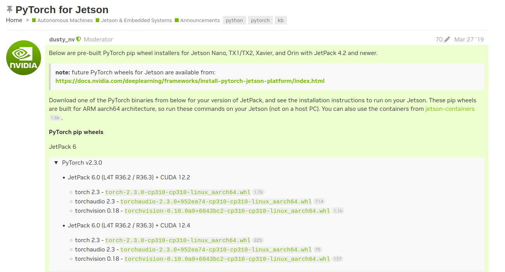

---
tags:
    - nx
    - pytorch
    - cuda
    - ai
---

# Install pytorch on Orin NX

Check cuda version using `nvidia-smi`


[nvidia Installing PyTorch for Jetson Platform](https://docs.nvidia.com/deeplearning/frameworks/install-pytorch-jetson-platform/index.html)

Download whl from [PyTorch for Jetson](https://forums.developer.nvidia.com/t/pytorch-for-jetson/72048)



## install dependencies

```bash
sudo apt-get install libopenblas-dev
```

## install using pip

```bash
python3 -m pip install --no-cache torch-2.3.0-cp310-cp310-linux_aarch64.whl
```

## check

```bash
>>> import torch
>>> torch.__version__
'2.3.0'
>>> torch.cuda.is_available()
True
>>> torch.cuda.device_count()
1
>>> torch.cuda.current_device()
0
>>> torch.cuda.device(0)
<torch.cuda.device object at 0xffff9aedc0d0>
>>> torch.cuda.get_device_name(0)
'Orin'

```

---

### TorchVision

```
python3 -m pip install --no-cache torchvision-0.18.0a0+6043bc2-cp310-cp310-linux_aarch64.whl
```

```bash
>>> import torchvision
>>> print("PyTorch: "+torchvision.__version__)
PyTorch: 0.18.0a0+6043bc2

```