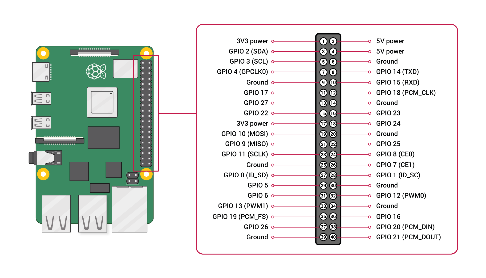
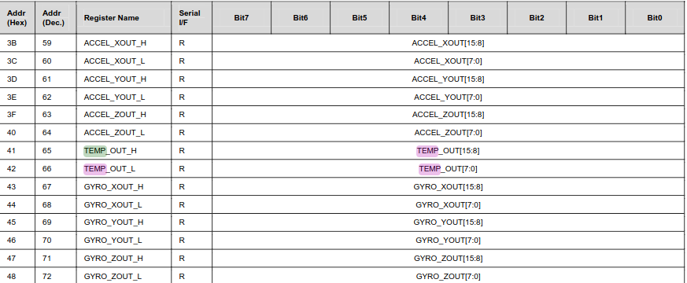
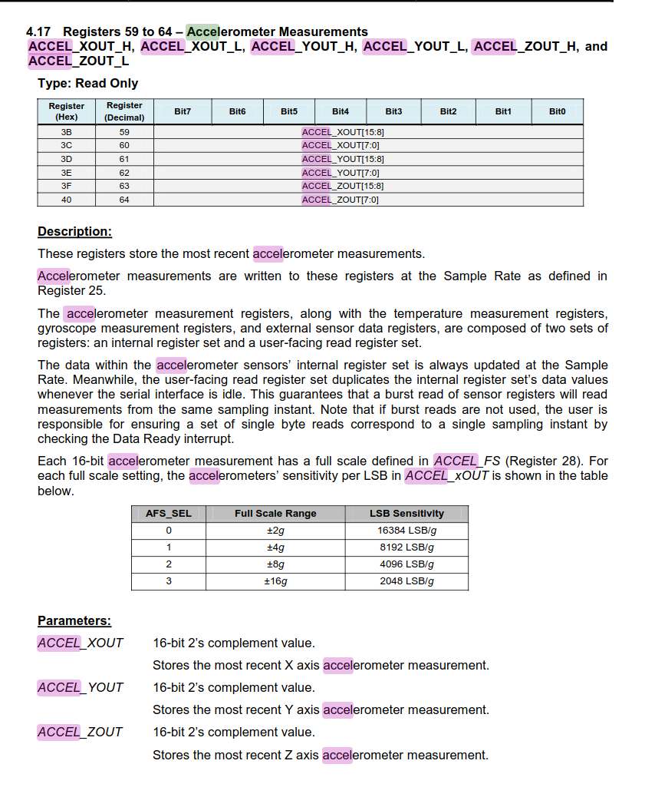

---
tags:
    - rpi
    - imu
    - mpu6050
---
# MPU 6050 RPi
Using mpu-6050 with python on Rpi

## Hardware
### Wiring

| ESP32  | MPU6050  |
|---|---|
| 1 (3.3v)  | VCC  |
| 6 (GND) | GND |
| 5 (I2C SCL) | SCL |
| 3 (I2C SDA) | SDA |




## Software

```bash
sudo apt-get install -y i2c-tools python3-smbus
```

```bash
lsmod | grep i2c_
```

```bash title="detect"
sudo i2cdetect -y 1

     0  1  2  3  4  5  6  7  8  9  a  b  c  d  e  f
00:                         -- -- -- -- -- -- -- -- 
10: -- -- -- -- -- -- -- -- -- -- -- -- -- -- -- -- 
20: -- -- -- -- -- -- -- -- -- -- -- -- -- -- -- -- 
30: -- -- -- -- -- -- -- -- -- -- -- -- -- -- -- -- 
40: -- -- -- -- -- -- -- -- -- -- -- -- -- -- -- -- 
50: -- -- -- -- -- -- -- -- -- -- -- -- -- -- -- -- 
60: -- -- -- -- -- -- -- -- 68 -- -- -- -- -- -- -- 
70: -- -- -- -- -- -- -- --  
```


---
## VSCode remote ssh
Working on rpi remotely using vscode

!!! note using ssh-remote ext

    ```ini title=".ssh/config"
    Host rpi
    HostName x.x.x.x
    User xxx
    IdentityFile=/home/user/.ssh/id_rsa
    ```

---

## Hello MPU-6050
[](https://invensense.tdk.com/wp-content/uploads/2015/02/MPU-6000-Register-Map1.pdf)


### Demo:  Read temperature




## Demo: Read Acceleration
Using python [mpu6050](https://github.com/m-rtijn/mpu6050) library




```python 
from mpu6050 import mpu6050

sensor = mpu6050(0x68)

accelerometer_data = sensor.get_accel_data()

print(accelerometer_data)
```
--- 

## Reference
- [python mpu-6050 library](https://github.com/m-rtijn/mpu6050)
- [MPU-6000 and MPU-6050 Register Map and Descriptions Revision 4.2](https://invensense.tdk.com/wp-content/uploads/2015/02/MPU-6000-Register-Map1.pdf)