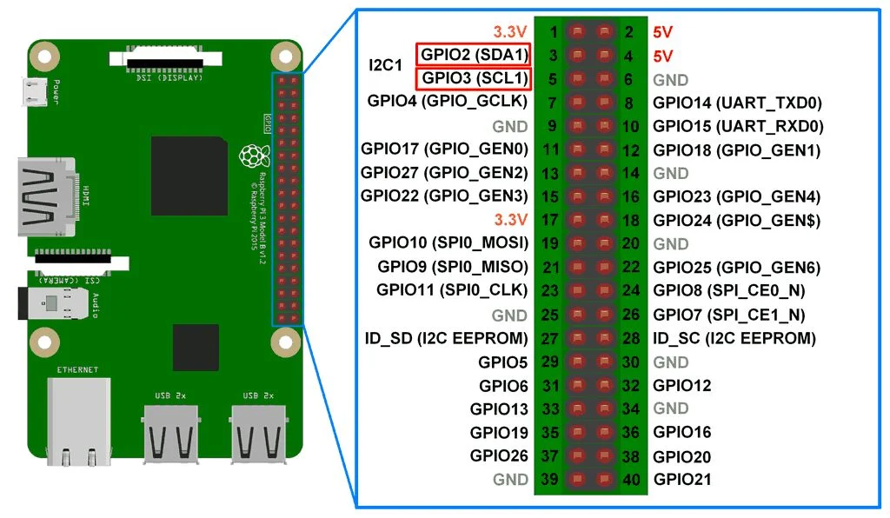

---
tags:
    - rpi
    - lidat
    - i2c
    - python
---


## Wire



| RPi  |   |
|---|---|
| SDA1 (3)  |   |
| SCL1 (5)  |   |
| GND (6)  | GND  |
| VCC 5.0 (2)  |    |


## Scan
```bash
i2cdetect -y -r 1

     0  1  2  3  4  5  6  7  8  9  a  b  c  d  e  f
00:                         -- -- -- -- -- -- -- -- 
10: -- -- -- -- -- -- -- -- -- -- -- -- -- -- -- -- 
20: -- -- -- -- -- -- -- -- -- -- -- -- -- -- -- -- 
30: -- -- -- -- -- -- -- -- -- -- -- -- -- -- -- -- 
40: -- -- -- -- -- -- -- -- -- -- -- -- -- -- -- -- 
50: -- -- -- -- -- -- -- -- -- -- -- -- -- -- -- -- 
60: -- -- -- -- -- -- 66 -- -- -- -- -- -- -- -- -- 
70: -- -- -- -- -- -- -- -- 
```

```python
import time
import smbus

i2c_ch = 1
ADDRESS = 0x66

# Initialize the I2C Bus with the appropritate I2C file.
# If you are using a Raspberyy Pi then the file is 1. Older Pis need File 0.
i2c = smbus.SMBus(i2c_ch)

def write():
	try:
		i2c.write_byte_data(ADDRESS, 0x00, 0x80)
		return 1
	except IOError:
		return 0

# Establish initial communication with the SF000.
while (not write()):
	write()


while True:
	# The reading is a 2 byte value that requires a byte swap.
	reading = i2c.read_word_data(ADDRESS, 0)   
	reading = ((reading >> 8) | (reading << 8)) & 0xFFFF
	
	# The measurement reading is now complete.
	print (reading, "cm")
	time.sleep(0.1)
```

## Reference
- [rpi_i2c_python.py](https://github.com/LightWare-Optoelectronics/SampleLibrary/blob/master/generic_raspberrypi_python_i2c/rpi_i2c_python.py)