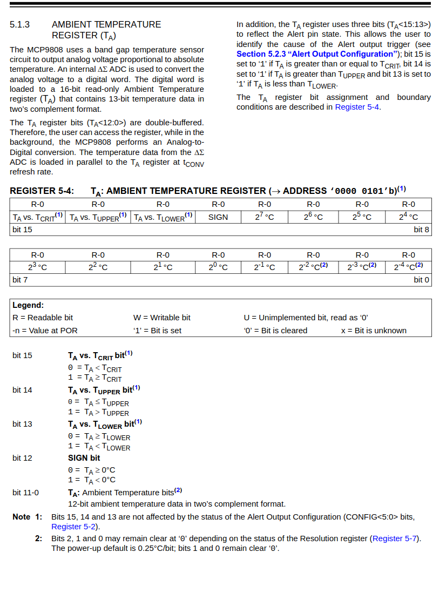
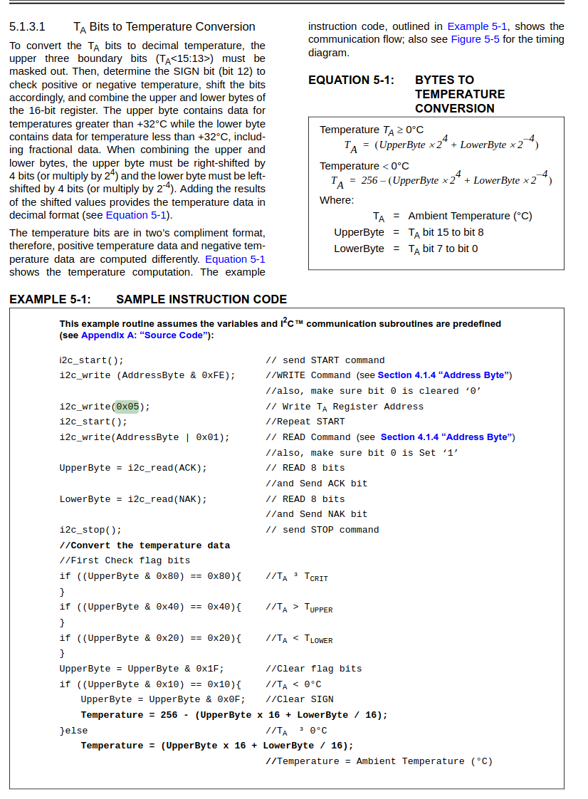

---
tags:
    - rpi
    - sensor
    - i2c
    - temperature
    - mcp9808
---

# MCP9808
Microchip Technology Inc.’s MCP9808 digital temperature sensor converts temperatures between -20°C and +100°C to a digital word

This sensor has an industry standard 400 kHz, 2-wire, SMBus/I 2C compatible serial interface, allowing up to eight or sixteen sensors to be controlled with a single
serial bus

## i2c 
```bash
i2cdetect -y -r 1
     0  1  2  3  4  5  6  7  8  9  a  b  c  d  e  f
00:                         -- -- -- -- -- -- -- -- 
10: -- -- -- -- -- -- -- -- 18 -- -- -- -- -- -- -- 
20: -- -- -- -- -- -- -- -- -- -- -- -- -- -- -- -- 
30: -- -- -- -- -- -- -- -- -- -- -- -- -- -- -- -- 
40: -- -- -- -- -- -- -- -- -- -- -- -- -- -- -- -- 
50: -- -- -- -- -- -- -- -- -- -- -- -- -- -- -- -- 
60: -- -- -- -- -- -- -- -- -- -- -- -- -- -- -- -- 
70: -- -- -- -- -- -- -- --    
```

### Addressing

|  A2| A1 | A0 | address
| -- | -- | -- | ----
|  0 | 0  | 0  |  0x18  this is the default address
|  0 | 0  | 1  |  0x19
|  0 | 1  | 0  |  0x1A
|  0 | 1  | 1  |  0x1B
|  1 | 0  | 0  |  0x1C
|  1 | 0  | 1  |  0x1D
|  1 | 1  | 0  |  0x1E
|  1 | 1  | 1  |  0x1F


---

## Read temperature




### Python example
```python
import smbus
import time

ADDRESS = 0x18
bus = smbus.SMBus(1)


# Select configuration register, 0x01(1)
# 0x0000(00) Continuous conversion mode, Power-up default

config = [0x00, 0x00]
REGISTER_CONFIG = 0x01
REGISTER_TA = 0x05
# write_i2c_block_data(i2c_address, register, data)
bus.write_i2c_block_data(ADDRESS, REGISTER_CONFIG, config)


# Read TA register MSB, TEMP LSB
# read_i2c_block_data(i2c_address, register, length)
data = bus.read_i2c_block_data(ADDRESS, REGISTER_TA, 2)

# clear flag bits
upper_byte = data[0] & 0x1f
lower_byte = data[1]
if upper_byte & 0x10 == 0x10:
    # TA < 0c 
    # clear sign
    upper_byte = upper_byte & 0x0F
    temperature = 256 - (upper_byte * 16 + lower_byte/16)
else:
    temperature = upper_byte * 16 + lower_byte/16

print (temperature)
```

---

## Reference
- [mcp9808 data shit](http://ww1.microchip.com/downloads/en/DeviceDoc/25095A.pdf)