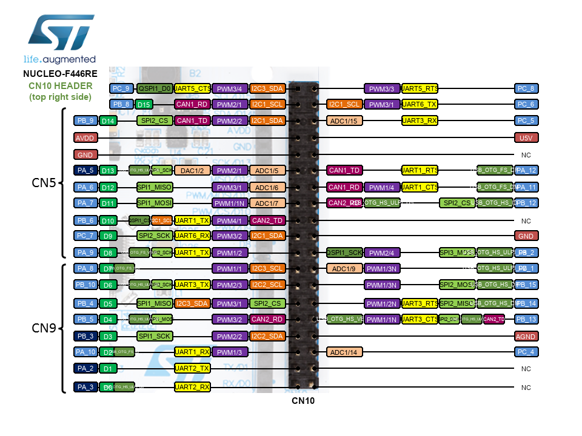

---
tags:
    - stm32
    - arduino
    - nucleo
    - vscode
    - platformio
---

# Arduino framework on stm32
simple Blink program using arduino (stm32duino) project

## Blink




### Wiring


### Code

```cpp title="main.cpp"
#include <Arduino.h>

#define LED_PIN PC6

void setup()
{
  pinMode(LED_PIN, OUTPUT);
}

void loop()
{
  digitalWrite(LED_PIN, HIGH);
  delay(1000);
  digitalWrite(LED_PIN, LOW);
  delay(1000);
}
```

!!! tip ""
    `PC6` leg on CN10 header
     

```ini title="platformio.ini"
[env:genericSTM32F446RE]
platform = ststm32
board = genericSTM32F446RE
framework = arduino
upload_protocol = stlink
```
---

## Reference
- [led-blinking-stm32-nucleo-arduino-ide](https://microcontrollerslab.com/led-blinking-stm32-nucleo-arduino-ide-gpio-pins/)
- [mbed stm f446RE pinout](https://os.mbed.com/platforms/ST-Nucleo-F446RE/)