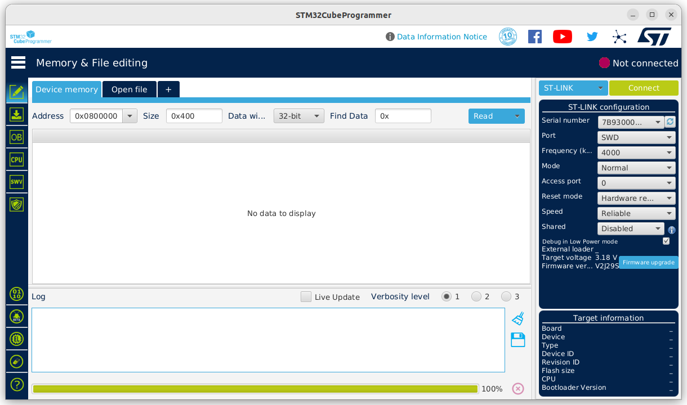

---
tags:
    - blue pill
    - swd
---

### ST-Link v2

### Blue pill pinout

### Cube Programmer
- Select ST-LINK
- Press Connect

---

---

## Reference
- [Program the STM32F103C8T6 Blue Pill](https://www.cytron.io/tutorial/program-the-stm32f103c8t6-blue-pill-led-blinking)