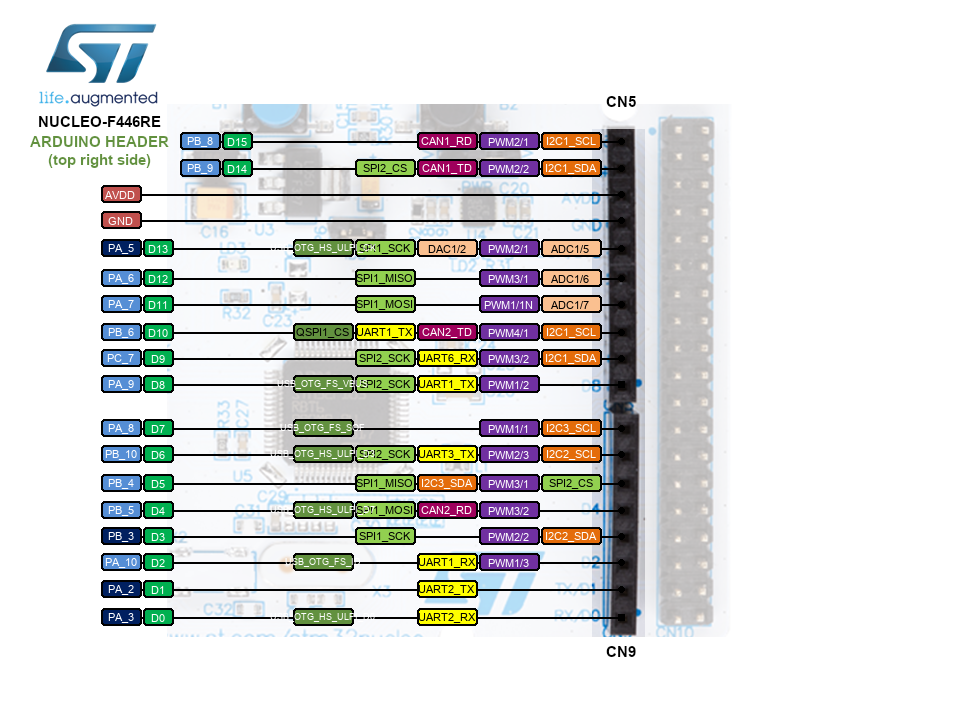
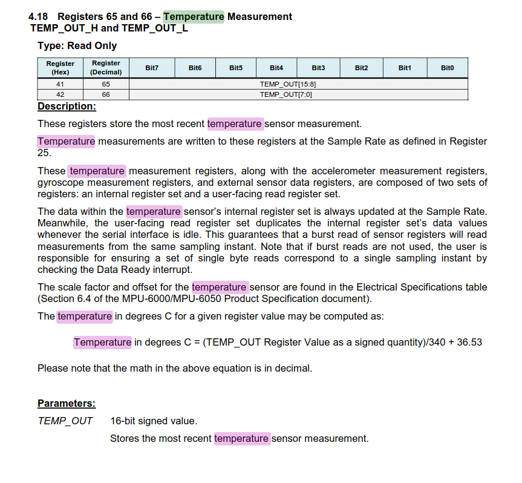

---
tags:
    - mbed
    - stm32
    - imu
    - i2c
    - mpu6050
    - tutorial
---

# Read mpu6050 data using mbed and stm32

## Hardware
- mpu6050
- STM32 board (nucleo-F446RE)

[mbed board nucleo-F446RE](https://os.mbed.com/platforms/ST-Nucleo-F446RE/)




## Wiring

| mpu5060  | STM F445RE |
|---|---|
| VCC  | CN8 arduino 3.3V |
| GND  | CN8 arduino GND  |
| SCL  | CN5 PB_8  |
| SDA  | CN5 PB_9  |

## Software

### i2c scanner

```cpp
#include "DigitalOut.h"
#include "PinNames.h"
#include "mbed.h"
#include "mbed_wait_api.h"

#define I2C1_SDA PB_9
#define I2C1_SCL PB_8

I2C i2c1(I2C1_SDA, I2C1_SCL);

int ack = 1;

int main() {
  debug("...................:[ I2C Scanner ]:...................\n\r");
  while (true) {
    debug("Scanning I2C Interface ...\r\n");
    for (int address = 1; address < 127; address++) {
      ack = i2c1.write(address << 1, "11", 1);
      if (ack == 0)
        debug("\tFound device at %3d -- %3x\r\n", address, address);
      ThisThread::sleep_for(10ms);
    }
    debug("Scan finished.\r\n");
    ThisThread::sleep_for(1s);
  }
}
```

!!! tip ""
    mbed use 8bit i2c address

    ```cpp
    const int addr7bit = 0x48;      // 7 bit I2C address
    const int addr8bit = 0x48 << 1; // 8bit I2C address, 0x90
    ```
     
### Read data using i2c
Read without predefine library

[MPU-6050 Register Map and Descriptions](https://invensense.tdk.com/wp-content/uploads/2015/02/MPU-6000-Register-Map1.pdf)



```
Temperature in degrees C = (TEMP_OUT Register Value as a signed quantity)/340 + 36.53
```

```cpp
#include "mbed.h"

#define I2C1_SDA PB_9
#define I2C1_SCL PB_8

I2C i2c(I2C1_SDA, I2C1_SCL);
#define MPU6050_ADDRESS 0x68<<1


void readBytes(uint8_t reg, uint8_t count, uint8_t *dest) {
    
    char data[14];
    char data_write[1] = {reg};
    i2c.write(MPU6050_ADDRESS, data_write, 1, true); // no stop
    i2c.read(MPU6050_ADDRESS, data, count, false);
    memcpy(dest, data, count);
}

int main()
{
    printf("Starting...\n\r");

    i2c.frequency(400000); // 400 kHz

    while (true) {

        // If data ready bit set, all data registers have new data
        uint8_t buffer[2]; // x/y/z register data stored here
        readBytes(0x41, 2, buffer);
        uint16_t counts = (int16_t)(((int16_t)buffer[0]) << 8 | buffer[1]);
        printf("temp: %.2f \n\r", ((float)counts) / 340.0f + 36.53f); // Temperature in degrees Centigrade
        thread_sleep_for(1000); // 10 Hz
    }
}
```

!!! tip "printf floating point"
    Add to `mbed_app.json`

    ```json
    {
    "target_overrides":{
        "*": {
            "platform.minimal-printf-enable-floating-point": true,
            "platform.minimal-printf-set-floating-point-max-decimals": 2

        }
    }
}
    ```
     