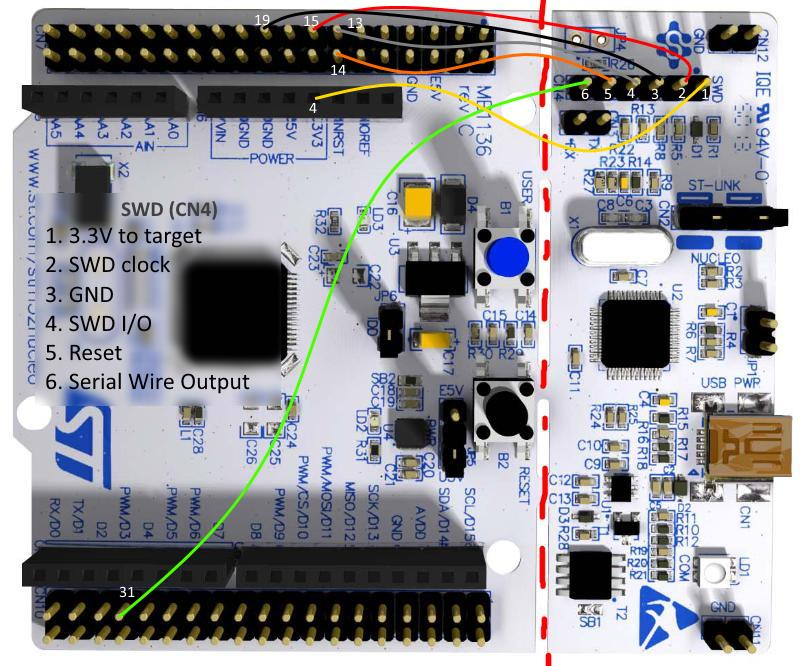

---
tags:
    - stm32
    - nucleo
    - swd
    - 
---

# How to connect swd to nucleo board

| swd  | nucleo f446RE  |
|---|---|
| **1** 3.3 v (note i connect 3.3 from JP1) |    |
| **2** SWD clock  | CN7 15  |
| **3** GND  | CN7 19  |
| **4** SWD I/O  | CN7 13  |
| **5** Reset  | CN7 14  |
| **6** Serial wire output  | CN10 31  |

## References
https://selliliar.live/product_details/30677689.html
https://os.mbed.com/questions/80077/Nucleo-5V-pin-only-show-27V-through-SWD/

