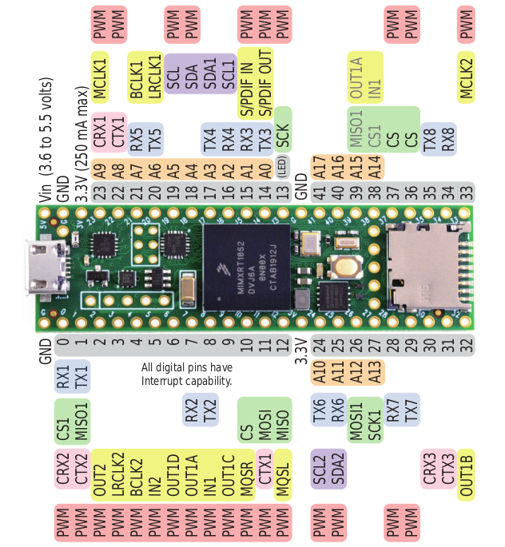

---
tags:
    - teensy
    - arduino
    - platformio
---

# Using Arduino with Teensy and platformio


### setup project
```bash
pio project init
```

```ini title="platformio.ini"
[env:teensy41]
platform = teensy
board = teensy41
framework = arduino

upload_port = /dev/ttyACM0
upload_protocol = teensy-cli
```

!!! warning "don't forget"
    upload_port = /dev/ttyACM0
    upload_protocol = teensy-cli


!!! warning "don't forget udev rule"
    [udev rule ](https://www.pjrc.com/teensy/00-teensy.rules)

    copy the file into `/etc/udev/rules.d/`

    ```
    sudo cp 00-teensy.rules /etc/udev/rules.d/00-teensy.rules
    ```

    **unplug and plug the device to run rules**


#### vscode cpp settings

```json title=".vscode/c_cpp_settings.json"
{
    "configurations": [
        {
            "name": "PlatformIO",
            "includePath": [
                "/home/user/.platformio/packages/framework-arduinoteensy/cores/teensy4/"
            ],
            "compilerPath": "/home/user/.platformio/packages/toolchain-gccarmnoneeabi-teensy/bin/arm-none-eabi-gcc"
        }
    ],
    "version": 4
}
```

### Test code
```cpp
#include <Arduino.h>

// Define the LED pin (for Teensy 4.x, the onboard LED is connected to pin 13)
const int ledPin = 13;

void setup() {
  // Initialize digital pin LED_BUILTIN as an output.
  pinMode(ledPin, OUTPUT);
}

void loop() {
  // Turn the LED on
  digitalWrite(ledPin, HIGH);
  delay(500);

  // Turn the LED off
  digitalWrite(ledPin, LOW);
  delay(500);
}

```

### Build and upload
```bash
#build
pio run

#upload
pio run -t upload
```

### Monitor

```bash
 pio device monitor -p /dev/ttyACM0
```