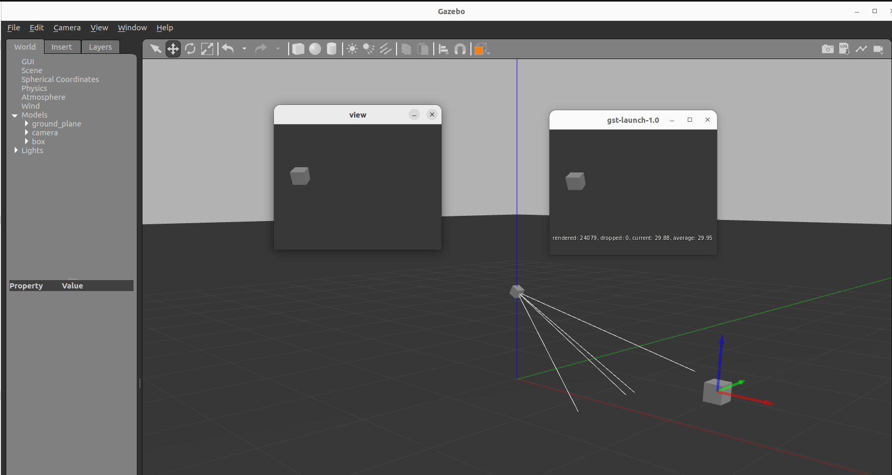

---
tags:
    - gazebo
    - gstreamer
    - camera
    - video
    - opencv
---

# Publish gazebo camera using Gstreamer
Standalone python application subscribe to gazebo image topic and publish the image over network using opencv and gstreamer

## prerequisites
- [pygazebo](https://github.com/robobe/pygazebo)
- opencv with gstreamer support
- gstreamer

## code

```python

import asyncio
import pygazebo
import cv2
import numpy as np
from threading import Thread
from queue import Queue, Empty

WIDTH = 320
HEIGHT = 240
FPS = 30

TOPIC = "/gazebo/default/camera/link/camera/image"
PIPE = f"""appsrc 
! video/x-raw, width={WIDTH}, height={HEIGHT}, framerate={FPS}/1,format=BGR 
! videoconvert 
! video/x-raw,format=I420 
! jpegenc 
! rtpjpegpay 
! udpsink host=127.0.0.1 port=5000"""

def process():
    """
    hanlder img queue
    """
    while True:
        try:
            frame = queue.get()
            out.write(frame)
        except Empty:
            print("Queue empty")
        except:
            print("error send image")


def image_handler(data):
    """get image from gazebo 
    put image in queue
    """
    image_stamped = pygazebo.msg.image_stamped_pb2.ImageStamped()
    image_stamped.ParseFromString(data)
    img_msg = image_stamped.image
    channels = 3
    im = np.ndarray(
        shape=(img_msg.height, img_msg.width, channels),
        dtype=np.uint8,
        buffer=img_msg.data,
    )
    queue.put(im)
    cv2.imshow("view", im)
    cv2.waitKey(1)
    


async def publish_loop():
    """subscribe
    """
    manager = await pygazebo.connect()
    subscriber = await manager.subscribe(
        TOPIC, "gazebo.msgs.ImageStamped", image_handler
    )
    while True:
        await asyncio.sleep(1)

queue = Queue()
out = cv2.VideoWriter(PIPE, cv2.CAP_GSTREAMER, 0, FPS, (WIDTH, HEIGHT), True)
t_handler = Thread(target=process, daemon=True)
t_handler.start()
loop = asyncio.get_event_loop()
loop.run_until_complete(publish_loop())
```

## Receiving Gstreamer pipe    

```bash
gst-launch-1.0 udpsrc port=5000 \
! application/x-rtp, encoding-name=JPEG,payload=26 \
! rtpjpegdepay \
! jpegdec \
! fpsdisplaysink
```

