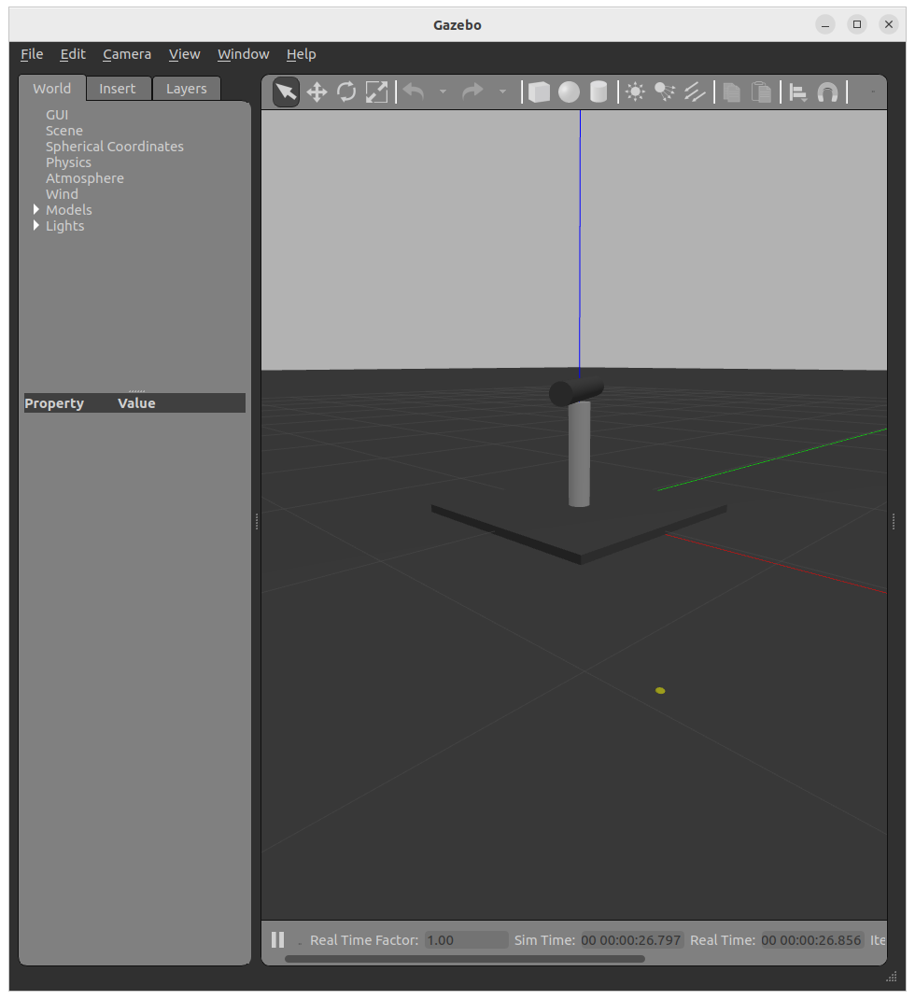

---
tags:
    - gazebo classic
    - plugin
    - joint
    - velocity
---

Joint velocity control plugin Tutorial


!!! tip "VSCode C++ include path"

    ```json
    "includePath": [
                "${workspaceFolder}/**",
                "/usr/include/gazebo-11/**",
                "/usr/include/ignition/**",
                "/usr/include/sdformat-9.7"
            ],
    ```

!!! tip "don't forget"
    Gazebo environment 

    - GAZEBO_PLUGIN_PATH
    - GAZEBO_RESOURCE_PATH
    - GAZEBO_MODEL_PATH
     


---

## Reference
- [Setting Velocity on Joints and Links](https://classic.gazebosim.org/tutorials?tut=set_velocity&cat=)
- [Gazebo plugin tutorial](https://sites.google.com/view/gazebo-plugin-tutorials/0-introduction?authuser=0)
