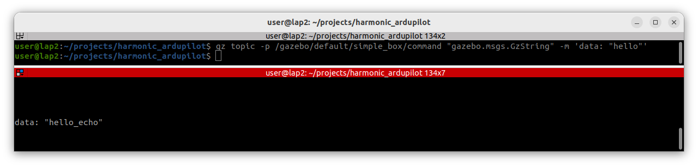

---
tags:
    - gazebo
    - classic
    - plugin
    - pub
    - topic
    - cli
    - gzstring
---
# Gazebo control using Code or CLI

Gazebo classic using Pub/Sub, Request/Replay patterns to allow user to listen and control simulation items.
The message can be send from Client implement using C++, python or from command line

## CLI
The `gz` command has multiple command to control gazebo
We use `topic` command to control and get status from model plugin the control revolute joint

```
 gz topic [options]

        Print topic information to standard out or publish a message on a topic.
If a name for the world, 
        option -w, is not specified, the first world found on 
        the Gazebo master will be used.

Options:
  --verbose               Print extra information
  -h [ --help ]           Print this help message
  -w [ --world-name ] arg World name.
  -l [ --list ]           List all topics.
  -i [ --info ] arg       Get information about a topic.
  -e [ --echo ] arg       Output topic data to screen.
  -v [ --view ] arg       View topic data using a QT widget.
  -z [ --hz ] arg         Get publish frequency.
  -b [ --bw ] arg         Get topic bandwidth.
  -p [ --publish ] arg    Publish message on a topic.
  -r [ --request ] arg    Send a request.
  -u [ --unformatted ]    Output data from echo without formatting.
  -d [ --duration ] arg   Duration (seconds) to run. Applicable with echo, hz, 
                          and bw
  -m [ --msg ] arg        Message to send on topic. Applicable with publish and
                          request
  -f [ --file ] arg       Path to a file containing the message to send on 
                          topic. Applicable with publish and request
```

# Pub message to gazebo plugin

Send message data from cli to control gazebo plugin

## Demo
TODO: Write minimal plugin with subscriber topic for gzstring message

```bash 
gz topic -p "/gazebo/default/iris_demo/gimbal_tilt_cmd"  "gazebo.msgs.GzString" -m 'data: "1.0"'
```

```
gz topic --echo /gazebo/default/iris_demo/command_request
```

```c++ title="NodeDemoPlugin.hh"
#pragma once
#include "gazebo/gazebo.hh"
#include "gazebo/common/common.hh"
#include "gazebo/msgs/msgs.hh"
#include "gazebo/physics/physics.hh"
#include "gazebo/transport/transport.hh"

namespace gazebo
{
    class NodeDemoPlugin : public ModelPlugin
    {
    public:
        NodeDemoPlugin();
        virtual void Load(physics::ModelPtr _model, sdf::ElementPtr _sdf);
        

    private:
        void OnRequestMsg(ConstGzStringPtr &_msg);
        transport::NodePtr node;
        transport::PublisherPtr pub;
        transport::SubscriberPtr sub;
    };
}
```

```c++ title="NodeDemoPlugin.cc"

#include <iostream>
#include "gazebo/transport/transport.hh"
#include "SimpleModelPlugin.hh"

using namespace gazebo;

GZ_REGISTER_MODEL_PLUGIN(NodeDemoPlugin)

NodeDemoPlugin::NodeDemoPlugin()
{
}

void NodeDemoPlugin::Load(physics::ModelPtr _model, sdf::ElementPtr _sdf)
{
    this->node = transport::NodePtr(new transport::Node());
    this->node->Init(_model->GetWorld()->Name());

    auto topic = std::string("~/") +  _model->GetName() + "/command";
    this->sub = this->node->Subscribe(topic,
      &NodeDemoPlugin::OnRequestMsg, this);

    auto pub_topic = std::string("~/") +  _model->GetName() + "/state";
    this->pub = this->node->Advertise<gazebo::msgs::GzString>(pub_topic);
}

void NodeDemoPlugin::OnRequestMsg(ConstGzStringPtr &_msg)
{
    gzmsg << _msg->data() << std::endl;
    gazebo::msgs::GzString m;
    m.set_data(_msg->data() + "_echo");
    this->pub->Publish(m);
}
```

```c title="CMakeLists.txt"
cmake_minimum_required(VERSION 3.11)
project(GazeboPlugins)

find_package(gazebo REQUIRED)

include_directories(
    ${GAZEBO_INCLUDE_DIRS}
    ${PROJECT_SOURCE_DIR}/include
)

add_library(NodeDemoPlugin SHARED NodeDemoPlugin.cc)
target_link_libraries(NodeDemoPlugin ${GAZEBO_LIBRARIES})

install(TARGETS

NodeDemoPlugin
  DESTINATION ${PROJECT_SOURCE_DIR}/bin
)
```

```xml title="simple.world"
<sdf version="1.6">
    <world name="default">
        <include>
            <uri>model://sun</uri>
        </include>
        <include>
            <uri>model://ground_plane</uri>
        </include>

        <model name="simple_box">
            <static>true</static>
            <link name="chassis">
                <pose>0 0 0.5 0 0 0</pose>
                <collision name="collision">
                    <geometry>
                        <box>
                            <size>1.0 1.0 1.0</size>
                        </box>
                    </geometry>
                </collision>
                <visual name="visual">
                    <geometry>
                        <box>
                            <size>1.0 1.0 1.0</size>
                        </box>
                    </geometry>
                </visual>
            </link>
            <plugin name="simple" filename="libNodeDemoPlugin.so" />
        </model>
    </world>
</sdf>
```

```bash title="topics"
gz topic --list | grep simple
/gazebo/default/simple_box/command
/gazebo/default/simple_box/state

```

```bash
gz topic -p "/gazebo/default/simple_box/command"  "gazebo.msgs.GzString" -m 'data: "1.0"'
```

```bash
gz topic --echo /gazebo/default/simple_box/command
```

