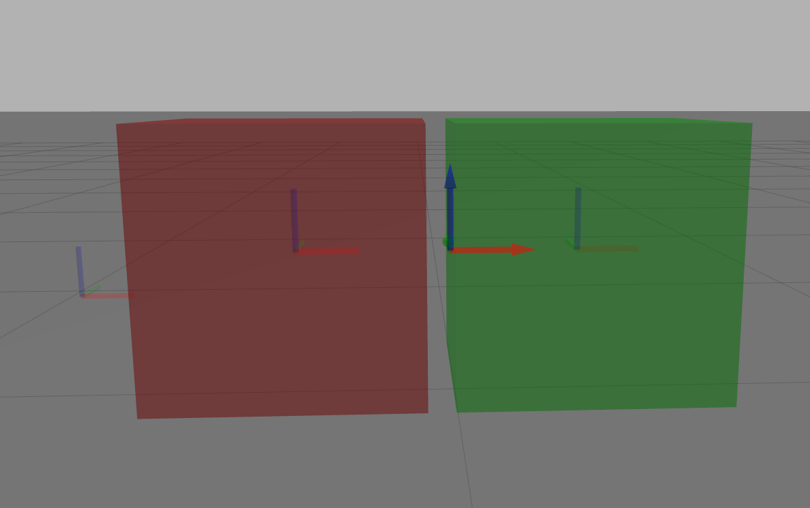

---
tags:
    - sdf
    - gazebo
    - joints
---

# SDF joins
A joint connects two links with kinematic and dynamic properties. By default, the pose of a joint is expressed in the **child link frame**.


## Joint Types
- Fixed
- Revolute
- Gearbox
- Revolute2
- Prismatic
- Ball
- Screw
- Universal


## Demo: demo_joint_types

[demo_joint_types github](https://github.com/osrf/gazebo_models/tree/master/demo_joint_types)


---

## Demo: Frame and Relative_to Pose attribute

```xml title="relative_to" linenums="1" hl_lines="33 37"
<?xml version="1.0"?>
<sdf version="1.7">
    <model name='my_model'>
       
        <link name="link1">
            <pose >0 0 0.25 0 0 0</pose>
            <collision name="collision1">
                <geometry>
                    <box>
                        <size>0.5 0.5 0.5</size>
                    </box>
                </geometry>
            </collision>
            <visual name="visual1">
                <geometry>
                    <box>
                        <size>0.5 0.5 0.5</size>
                    </box>
                </geometry>
                <material>
                    <script>
                        <uri>file://media/materials/scripts/gazebo.material</uri>
                        <name>Gazebo/Red</name>
                    </script>
                </material>
            </visual>
        </link>

        <joint name="l12l2_joint" type="fixed">
            <parent>link1</parent>
            <child>link2</child>
            
            <pose relative_to="link1">0.30 0 0 0 0 0</pose>
        </joint>

        <link name="link2">
            <pose relative_to="l12l2_joint">0.25 0 0 0 0 0</pose>
            <collision name="collision">
                <geometry>
                    <box>
                        <size>0.5 0.5 0.5</size>
                    </box>
                </geometry>
            </collision>
            <visual name="visual">
                <geometry>
                    <box>
                        <size>0.5 0.5 0.5</size>
                    </box>
                </geometry>
                <material>
                    <script>
                        <uri>file://media/materials/scripts/gazebo.material</uri>
                        <name>Gazebo/Green</name>
                    </script>
                </material>
            </visual>
        </link>


    </model>
</sdf>
```




