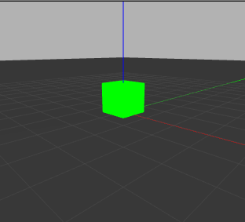

     


## Demo
#### basic sdf


#### model folder struct
```
└── simple_box
    ├── model.config
    └── model.sdf
```

#### files

```xml title="model.config"
<?xml version="1.0"?>
<model>
  <name>simple_box</name>
  <version>1.0</version>
  <sdf version="1.5">model.sdf</sdf>
  <author>
    <name></name>
    <email></email>
  </author>
  <description>
  </description>
</model> 
```

```xml title="sdf"
<?xml version='1.0'?>
<sdf version="1.4">
  <model name="simple_box">
    <pose>0 0 0.5 0 0 0</pose>
    <static>true</static>
    <link name="link">
      <inertial>
        <mass>1.0</mass>
        <inertia> <!-- inertias are tricky to compute -->
          <!-- http://gazebosim.org/tutorials?tut=inertia&cat=build_robot -->
          <ixx>0.083</ixx>       <!-- for a box: ixx = 0.083 * mass * (y*y + z*z) -->
          <ixy>0.0</ixy>         <!-- for a box: ixy = 0 -->
          <ixz>0.0</ixz>         <!-- for a box: ixz = 0 -->
          <iyy>0.083</iyy>       <!-- for a box: iyy = 0.083 * mass * (x*x + z*z) -->
          <iyz>0.0</iyz>         <!-- for a box: iyz = 0 -->
          <izz>0.083</izz>       <!-- for a box: izz = 0.083 * mass * (x*x + y*y) -->
        </inertia>
      </inertial>
      <collision name="collision">
        <geometry>
          <box>
            <size>1 1 1</size>
          </box>
        </geometry>
      </collision>
      <visual name="visual">
        <geometry>
          <box>
            <size>1 1 1</size>
          </box>
        </geometry>
      </visual>
    </link>
  </model>
</sdf>
```


---

#### predefine color

- using predefine script
  
```xml
<visual name="visual">
    <geometry>
        <box>
        <size>1 1 1</size>
        </box>
    </geometry>
    <material>
        <script>
            <uri>file://media/materials/scripts/gazebo.material</uri>
            <name>Gazebo/Red</name>
        </script>
    </material>
</visual>
```

!!! note "materials list"
    list of materials define in gazebo file
    `/usr/share/gazebo-11/media/materials/scripts/gazebo.material`
    for example the RED definition 

    ```
    material Gazebo/Red
    {
    technique
    {
        pass ambient
        {
        ambient 1 0 0
        diffuse 1 0 0
        specular 0.1 0.1 0.1 1 1
        }
    }
    }
    ```


---

#### Custom color

```xml
<visual name="visual">
    <geometry>
        <box>
        <size>1 1 1</size>
        </box>
    </geometry>
    <material> <!-- LED material -->
        <ambient>0 0 0 1</ambient>
        <diffuse>0 0 0 1</diffuse>
        <specular>0 0 0 0</specular>
        <emissive>0 1 0 1</emissive>
    </material> <!-- End LED material -->
</visual>
```



---

### Texture

```
└── simple_box
    ├── materials
    │   ├── scripts
    │   │   └── simple_box.material
    │   └── textures
    │       └── seamless_texture.png
    ├── model.config
    └── model.sdf
```

```c title="simple_box.material"
material wood/light
{
  technique
  {
    pass
    {
      texture_unit
      {
        // Relative to the location of the material script
        texture ../textures/seamless_texture.png
        // Repeat the texture over the surface (4 per face)
        scale 0.5 0.5
      }
    }
  }
}
```

```xml
<visual name="visual">
    <geometry>
        <box>
        <size>1 1 1</size>
        </box>
    </geometry>
    <material>
        <script>
            <uri>file:///home/user/dev_ws/src/rrbot/rrbot_description/models/simple_box/materials/scripts</uri>
            <uri>file:///home/user/dev_ws/src/rrbot/rrbot_description/models/simple_box/materials/textures</uri>
            <name>wood/light</name>
        </script>
    </material>
</visual>
```

!!! note "uri"
    use `model uri` and set `GAZEBO_MODEL_PATH`  
    or use `file://` to set absolute path
     


---

### stl mesh

!!! warning
    - **STL**: does not support colors and texturing
    - **Collada (.dae)**: support color and texture

#### stl color

```xml
<visual name="visual">
    <geometry>
        <mesh>
        <uri>file:///home/user/dev_ws/src/rrbot/rrbot_description/models/simple_box/meshes/cube_20k.stl</uri>
        <scale>0.25 0.25 0.25</scale>
        </mesh>
    </geometry>
    <material>
        <script>
        <uri>file://media/materials/scripts/gazebo.material</uri>
        <name>Gazebo/Red</name>
    </script>
    </material>
</visual>
```

#### stl with texture
```xml
<visual name="visual">
    <geometry>
        <mesh>
        <uri>file:///home/user/dev_ws/src/rrbot/rrbot_description/models/simple_box/meshes/cube_20k.stl</uri>
        <scale>0.5 0.5 0.5</scale>
        </mesh>
    </geometry>
    <material>
        <script>
        <uri>file:///home/user/dev_ws/src/rrbot/rrbot_description/models/simple_box/materials/scripts</uri>
        <uri>file:///home/user/dev_ws/src/rrbot/rrbot_description/models/simple_box/materials/textures</uri>
        <name>wood/light</name>
        </script>
    </material>
</visual>
```


---

### Collada / dea

Example from [gazebo_models](https://github.com/osrf/gazebo_models/tree/master/box_target_red)

```xml title="library_images "
<library_images>
    <image id="start_pad_png" name="start_pad_png">
        <init_from>end_pad.png</init_from>
    </image>
</library_images>


```


----

# Reference
- [Color And Texture Models](https://classic.gazebosim.org/tutorials?tut=color_model)