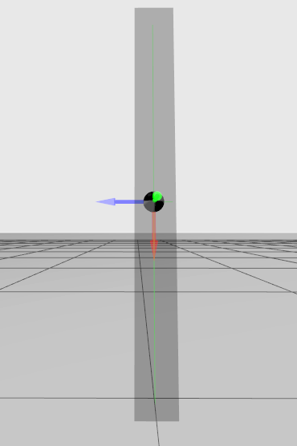

---
tags:
    - gazebo
    - workshope
    - sdf
    - vscode
---

## Set `GZ_SIM_RESOURCE_PATH`

```bash
export GZ_SIM_RESOURCE_PATH=$GZ_SIM_RESOURCE_PATH:/home/user/rrbot_ws/src/rrbot_description/models
```


## Using service to spawn and remove models

```bash title="Create/Add"
gz service -s /world/empty/create \
--reqtype gz.msgs.EntityFactory \
--reptype gz.msgs.Boolean \
--timeout 300 \
--req \
'sdf_filename: "models/m1/model.sdf" pose: {position: {z: 0}} name: "new_name"'
```

```bash title="Remove"
gz service -s /world/empty/remove \
--reqtype gz.msgs.Entity \
--reptype gz.msgs.Boolean \
--timeout 300 \
--req 'name: "new_name" type: MODEL'
```


rotate positive pitch (Y/Green axes)
Check positive rotation with right hand rule

