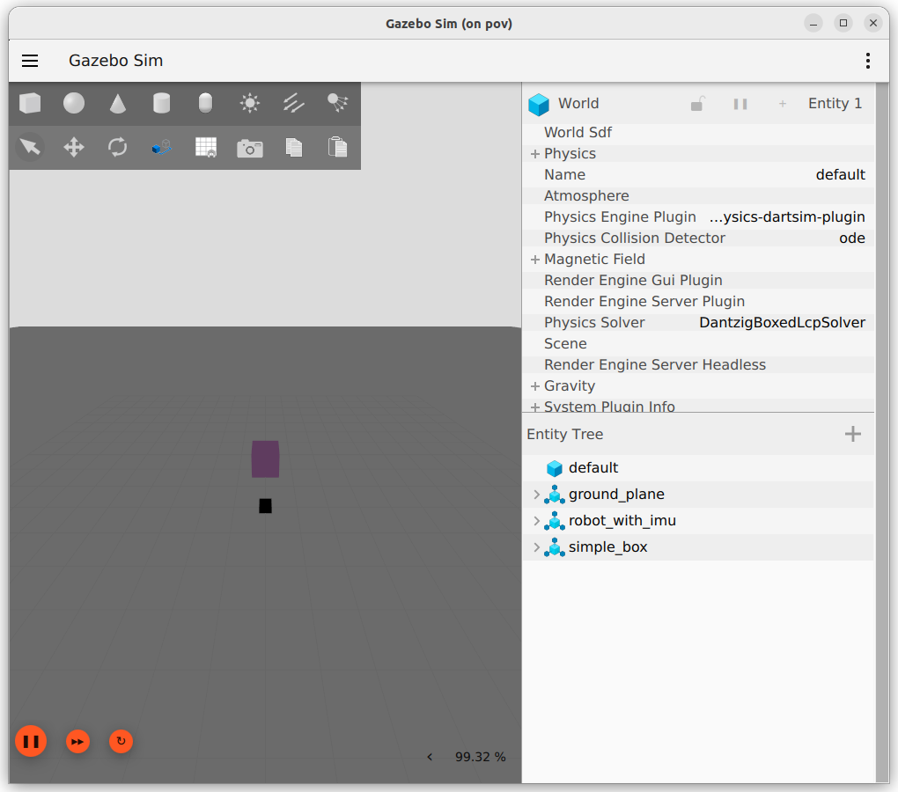
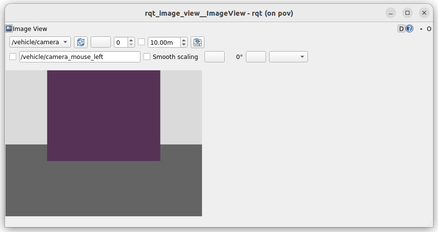

---
tags:
    - gazebo
    - harmonic
    - gz
    - simulation
    - ros
    - bridge
---

# Gazebo harmonic
[Gazebo official site](https://gazebosim.org/docs/harmonic/getstarted/)


## install
[gazebo docs install](https://gazebosim.org/docs/harmonic/install_ubuntu/)

```bash
```

---

## ROS2 bridge

[gazebo docs - Installing Gazebo with ROS](https://gazebosim.org/docs/harmonic/ros_installation/)
[gazebo docs - Use ROS 2 to interact with Gazebo](https://gazebosim.org/docs/harmonic/ros2_integration/)


### Install

!!! note ""
     
    Install bridge from osrf repository

```bash title="set gazebo and bridge in dockerfile"
RUN curl https://packages.osrfoundation.org/gazebo.gpg --output /usr/share/keyrings/pkgs-osrf-archive-keyring.gpg \
  && echo "deb [arch=$(dpkg --print-architecture) signed-by=/usr/share/keyrings/pkgs-osrf-archive-keyring.gpg] http://packages.osrfoundation.org/gazebo/ubuntu-stable $(lsb_release -cs) main" | sudo tee /etc/apt/sources.list.d/gazebo-stable.list > /dev/null \
  && apt-get update && apt-get install -q -y --no-install-recommends \
  gz-harmonic \
  ros-humble-ros-gzharmonic \
  && rm -rf /var/lib/apt/lists/*
```

```bash
apt-get install ros-humble-ros-gzharmonic
```

### Check
[bridge github](https://github.com/gazebosim/ros_gz/blob/ros2/ros_gz_bridge/README.md)
send message from side to side
(no need to run gz sim for this check)

send string message from gz to ros and from ros to gz using cli
- Run bridge
- Pub from GZ echo in ROS
- Pub from ROS echo in GZ
- 
```bash title="Terminal1: bridge"
ros2 run ros_gz_bridge parameter_bridge /chatter@std_msgs/msg/String@gz.msgs.StringMsg
#
[INFO] [1734974012.615668960] [ros_gz_bridge]: Creating GZ->ROS Bridge: [/chatter (gz.msgs.StringMsg) -> /chatter (std_msgs/msg/String)] (Lazy 0)
[INFO] [1734974012.616345817] [ros_gz_bridge]: Creating ROS->GZ Bridge: [/chatter (std_msgs/msg/String) -> /chatter (gz.msgs.StringMsg)] (Lazy 0)
```

#### pub data from gz to ros
```bash title="Terminal2: ros subscribe"
ros2 topic echo /chatter
```

```bash title="Terminal3: gz pub"
gz topic -t /chatter -m gz.msgs.StringMsg -p 'data:"Hello"'
```

#### pub data from ros to gz

```bash title="Terminal2: ros pub"
ros2 topic pub /chatter std_msgs/msg/String "data: 'Hi'"
```

```bash title="Terminal3: gz sub"
gz topic -e -t /chatter
```

---

### Send camera image

```xml
<plugin
    filename="gz-sim-scene-broadcaster-system"
    name="gz::sim::systems::SceneBroadcaster">
</plugin>

<plugin
    filename="gz-sim-sensors-system"
    name="gz::sim::systems::Sensors">
    <render_engine>ogre2</render_engine>
</plugin>
```

```xml
<sensor name="camera" type="camera">
    <camera>
        <horizontal_fov>1.047</horizontal_fov>
        <image>
            <width>320</width>
            <height>240</height>
        </image>
        <clip>
            <near>0.1</near>
            <far>100</far>
        </clip>
    </camera>
    <always_on>1</always_on>
    <update_rate>15</update_rate>
    <visualize>true</visualize>
    <topic>/vehicle/camera</topic>
</sensor>
```
```
gz topic --list
/clock
...
/vehicle/camera
/vehicle/camera_info
```

Bridge send data from gz to ros one way

!!! tip parameter_bridge
    ```
    parameter_bridge <topic@ROS2_type@gz_type>
    ```

!!! tip sign between ros2 type to gz type
    @  == a bidirectional bridge, 
    [  == a bridge from Gazebo to ROS,
    ]  == a bridge from ROS to Gazebo.
     


```bash title="bridge"
ros2 run ros_gz_bridge parameter_bridge /vehicle/camera@sensor_msgs/msg/Image[gz.msgs.Image

```

```bash
ros2 topic list
/parameter_events
/rosout
/vehicle/camera
```

##### gazebo



##### RQT



---

## Reference
- [gazebo tests (worlds, plugins)](https://github.com/gazebosim/gz-sim/tree/gz-sim9/test)
- [ROS Bridge](https://github.com/gazebosim/ros_gz/blob/ros2/ros_gz_bridge/README.md)
- [ROS Bridge yaml](https://github.com/gazebosim/ros_gz/blob/jazzy/ros_gz_bridge/README.md#example-1a-gazebo-transport-talker-and-ros-2-listener)
- [bridge launch](https://gazebosim.org/docs/harmonic/ros2_integration/)