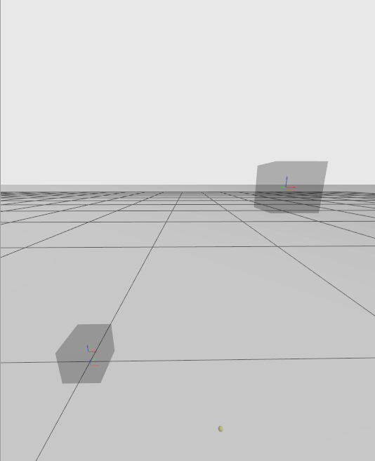
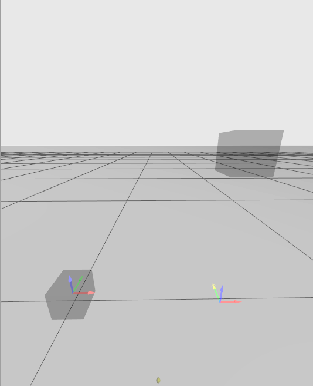
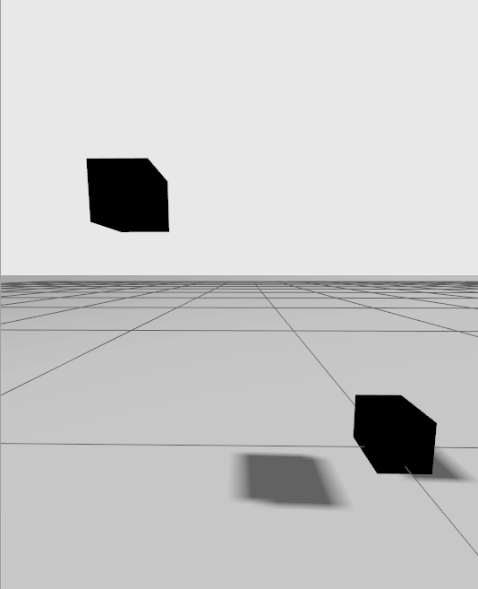

---
tags:
    - gazebo
    - sdf
    - pose
---

# Model Link Joint pose relation

```xml
<sdf version="1.9" xmlns:xsi="http://www.w3.org/2001/XMLSchema-instance"
    xsi:noNamespaceSchemaLocation="http://sdformat.org/schemas/root.xsd">
    <model name="two_links_orthogonal_1">
        <pose>1 0 0 0 0 0</pose>
        <link name="linkA">
            <pose>0 0 0.05 0 0 0</pose>
            <visual name="visual">
                <geometry>
                    <box>
                        <size>0.1 0.1 0.1</size>
                    </box>
                </geometry>
            </visual>
        </link>
        <link name="linkB">
            <pose>0.5 0 0.5 0 0 0</pose>
            <visual name="visual">
                <geometry>
                    <box>
                        <size>0.1 0.1 0.1</size>
                    </box>
                </geometry>
            </visual>
        </link>
        <joint name="jointAB" type="revolute">
            <pose>0 0 -0.5 0 0 0</pose>
            <parent>linkA</parent>
            <child>linkB</child>
            <axis>
                <xyz>0 1 0</xyz>
            </axis>
        </joint>
        <joint name="joint_world" type="fixed">
            <parent>world</parent>
            <child>linkA</child>
        </joint>
    </model>
</sdf>
```

## frame
Each element has it's on **frame**
by default link frame is relative to parent link

joint frame is relative to **child** link

### Example






- World_LinkA Joint
- LinkA_LinkB Joint relative to LinkB (`<pose>0 0 -0.5 0 0 0</pose>`)





 gz topic -t "/rotor_cmd" -m gz.msgs.Double -p "data: 0.787"