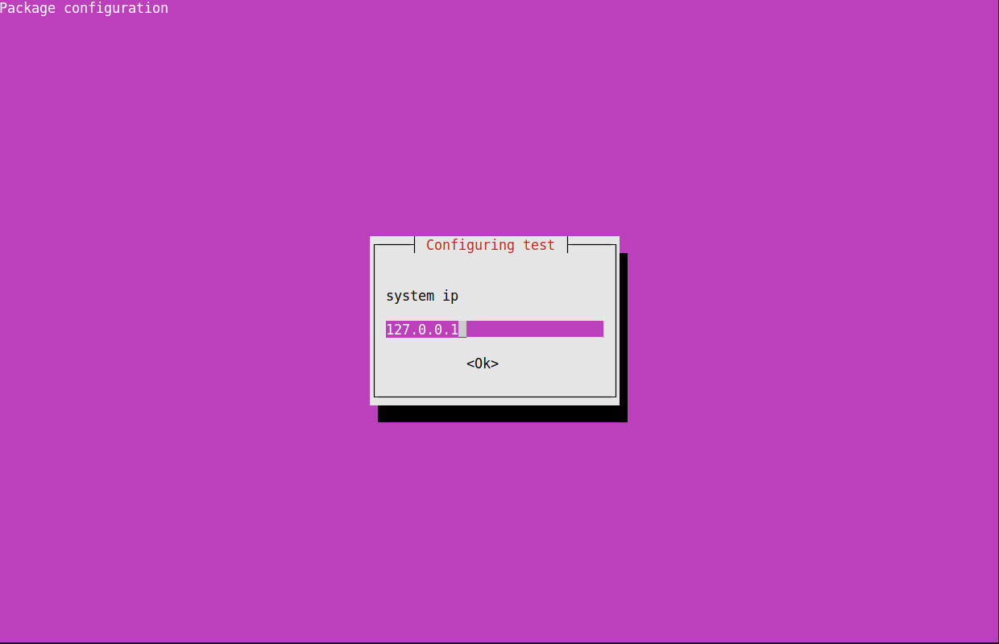

---
tags:
    - deb
    - debian
    - debconf
    - dpkg
---


## Demo
Simple DEB file that install nothing


```title="project"
├── test-deb
│   └── DEBIAN
│       ├── config
│       ├── control
│       ├── postinst
│       └── templates
```

!!! tip permissions

     don't forget to set files permissions

     ```bash
     chmod +x test-deb/DEBIAN/postinst
     chmod +x test-deb/DEBIAN/config
     ```

```bash title="control"
Package: test-deb
Version: 0.0.1
Section: utils
Priority: optional
Architecture: all
Maintainer: robobe <test@test.com>
Description: simple pkg with bash script

```

```bash title="config"
#!/bin/sh -e

# Source debconf library.
. /usr/share/debconf/confmodule

# Ask questions
db_set  test-deb/select1 no
db_set  test-deb/select2 no

db_input high test-deb/select1
db_input high test-deb/select2
db_input high test-deb/ip
# Show interface
db_go
```

```bash title="templates"
Template: test-deb/select1
Type: select
Choices: yes, no
Default: no
Description: Create default schema?
 Create schema

Template: test-deb/select2
Type: select
Choices: yes, no
Default: no
Description: description line 1
 description line 1

Template: test-deb/ip
Type: string
Default: 127.0.0.1
Description: system ip
```

```bash title="postinst"
#!/bin/bash
export DEBCONF_DEBUG=developer

. /usr/share/debconf/confmodule

set -e # fail on any error
set -u # treat unset variables as errors
# ======[ Trap Errors ]======#
set -E # let shell functions inherit ERR trap

# Source debconf library.
. /usr/share/debconf/confmodule

db_get test-deb/select1
select1=$RET
db_get test-deb/select2
select2=$RET
db_get test/ip
ip=$RET
echo $ip, $select1, $select2 > /tmp/a
```

---

### Build
```bash
dpkg-deb --build test-deb
```
### Install

!!! tip Clear CACHE
     ```bash
    echo PURGE | sudo debconf-communicate test-deb
    ```

    - TODO: How to clear cache from purge

```bash
sudo dpkg -i test-deb.deb 
```


### Remove

```bash
sudo apt purge test-deb -y 
```

---

## debconf
Debconf is a configuration system for Debian packages

!!! tip Clear CACHE

    ```bash
    # echo PURGE | sudo debconf-communicate <package name>

    echo PURGE | sudo debconf-communicate test-deb
    ```
     
#### Show

```bash
# sudo debconf-show <package name>
sudo debconf-show test-deb
```

---

## Reference
- [DEBCONF-DEVEL(7)](https://manpages.debian.org/bookworm/debconf-doc/debconf-devel.7.en.html)

