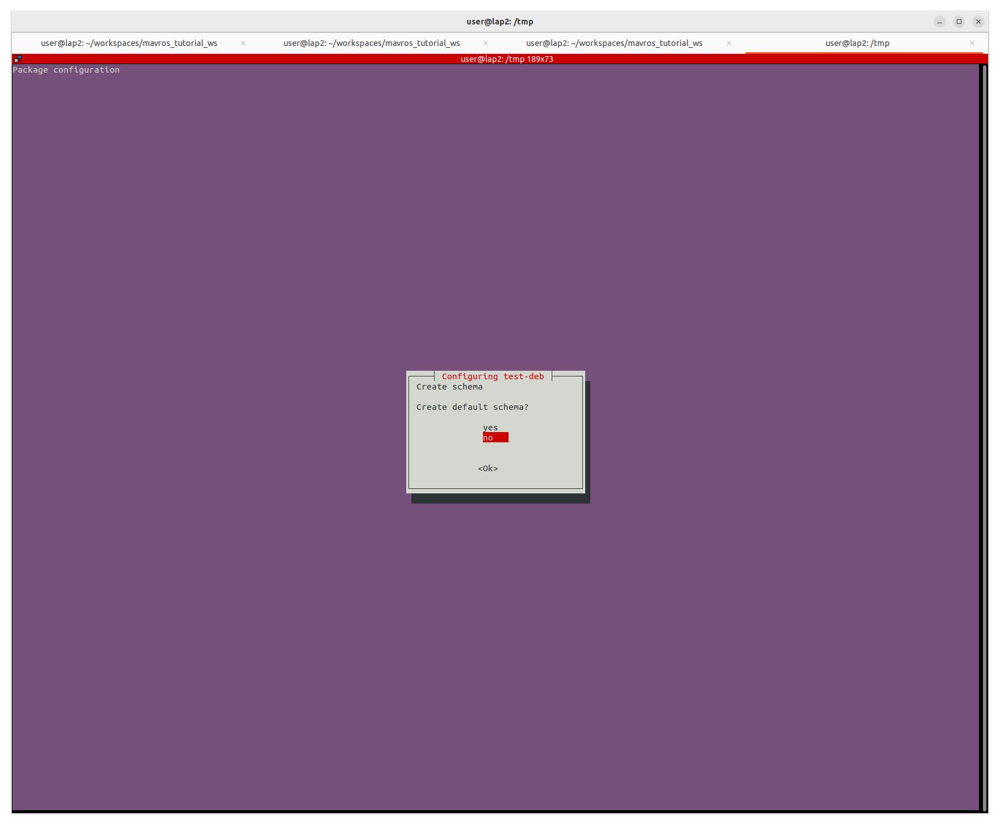
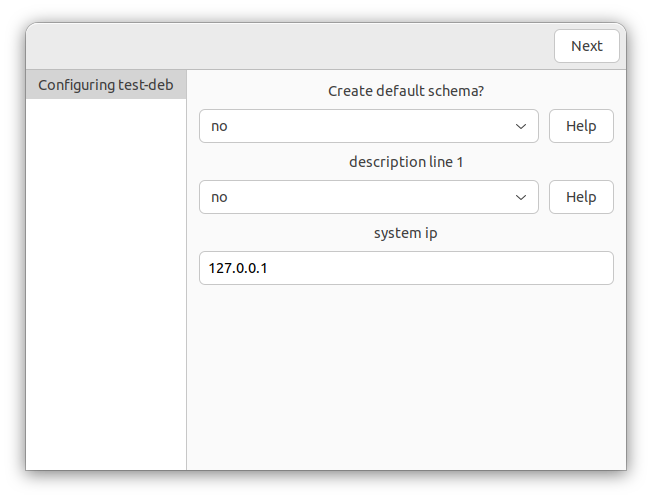

---
tags:
    - deb
    - debconf
    - dpkg-show
    - dpkg-reconfigure
    - debconf-communicate
---
# debconf
debconf - Debian package configuration system (man [page](https://manpages.ubuntu.com/manpages/trusty/man7/debconf.7.html))

debconf provides a consistent interface for configure packages

- fontend: several user interface (console, tui, gui)
- backend: config from `/etc/debconf.conf` save static data like templates and dynamic data [man page (5)](https://manpages.ubuntu.com/manpages/trusty/man5/debconf.conf.5.html)

---

### dpkg-reconfigure
Is a command line tool used to reconfigure an already installed package


#### demo
Using the test-deb package for example

```bash title="configure using terminal gui"
sudo dpkg-reconfigure test-deb
```




##### gnome frontend
```bash title="configure using gnome"
sudo dpkg-reconfigure -f gnome test-deb
```




---

### debconf-communicate

debconf-communicate allows you to communicate with debconf on the fly, from the command line [man page](https://manpages.ubuntu.com/manpages/focal/en/man1/debconf-communicate.1.html)

```bash title="get"
echo "get test-deb/select2" | debconf-communicate
```

```bash title="set"
echo "set test-deb/select2 yes" | sudo debconf-communicate
```

---

### python defconfig

!!! note "python3-debconf"
    Try to work with this package without success
    Need more time to check the source code  

    ```python
    import debconf

    help(debconf.Debconf)
    ```

```python
# echo "get test-deb/select2" | debconf-communicate
import subprocess

args = ["debconf-communicate"]
dccomm = subprocess.Popen(
            args, stdin=subprocess.PIPE, stdout=subprocess.PIPE,
            close_fds=True, universal_newlines=True)

output = dccomm.communicate("get test-deb/ip")[0]
print(output)
```