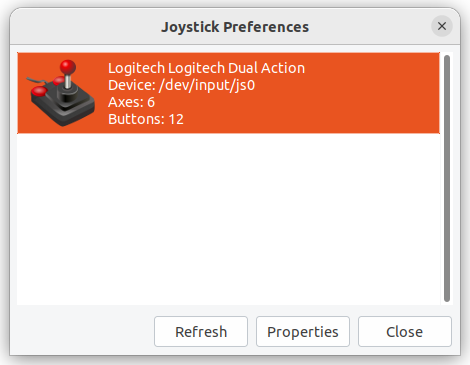
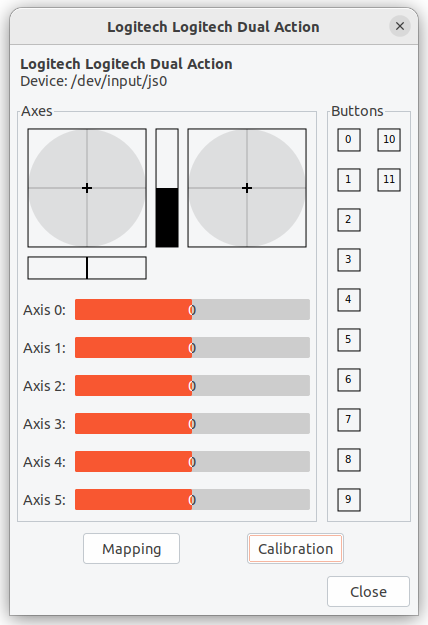

---
tags:
    - linux
    - joystick
    - docker
---
# Joystick

How linux map joystick hardware to file interface

Test the connected joystick on host and docker


### check for joystick

```bash
dmesg | grep Joystick
#
[35877.461470] logitech 0003:046D:C216.0006: input,hidraw3: USB HID v1.11 Joystick [Logitech Logitech Dual Action] on usb-0000:00:14.0-1/input0 
```

#### map between sysfs to device handler
```bash hl_lines="6"
cat /proc/bus/input/devices | grep "usb-0000:00:14.0-1/input0" -A 5
#
P: Phys=usb-0000:00:14.0-1/input0
S: Sysfs=/devices/pci0000:00/0000:00:14.0/usb3/3-1/3-1:1.0/0003:046D:C216.0006/input/input32
U: Uniq=8C92A916
H: Handlers=event18 js0 
B: PROP=0
B: EV=1b

```

!!! note multiple handler
    Device can by multiple handler / file 
    each of them handle the data in different way

---     
## jstest-gtk
joystick testing and configuration tool

```bash
sudo apt install jstest-gtk
```

```
jstest-gtk
```




## jstest

```bash
sudo apt install joystick
```

#### Test with `jstest`
```bash
jstest /dev/input/js0
#
Driver version is 2.1.0.
Joystick (Logitech Logitech Dual Action) has 6 axes (X, Y, Z, Rz, Hat0X, Hat0Y)
and 12 buttons (Trigger, ThumbBtn, ThumbBtn2, TopBtn, TopBtn2, PinkieBtn, BaseBtn, BaseBtn2, BaseBtn3, BaseBtn4, BaseBtn5, BaseBtn6).
Testing ... (interrupt to exit)
Axes:  0:     0  1:     0  2:     0  3:     0  4:     0  5:     0 Buttons:  0:off  1:off  2:off  3:off  4:off
```

#### by-id

```bash
lrwxrwxrwx 1 root root  10 Sep 20 09:35 usb-Logitech_Logitech_Dual_Action_8C92A916-event-joystick -> ../event18
lrwxrwxrwx 1 root root   6 Sep 20 09:35 usb-Logitech_Logitech_Dual_Action_8C92A916-joystick -> ../js0
```

---

### Docker
Share hardware between host and docker 


```bash title="check driver id"
ll /dev/input/js0
crw-rw-r--+ 1 root input 13, 0 Sep 20 09:35 /dev/input/js0
```

!!! note share joystick / device without privilege docker argument
     
!!! tip device-cgroup-rule
    The `--device-cgroup-rule` option allows you to specify rules for dynamically creating devices within a container. it allow add new devices to a running container without having to restart it.

```bash
docker run -it --rm \
--user user \
--network=host \
--ipc=host \
-v /dev:/dev \
--device-cgroup-rule="c 13:* rmw" \
humble:dev \
/bin/bash

```

!!! note 
    - **rmw**: stands for read, write, and mknod permissions
    - **c**: character device
    - **major**: major device id
    - **minor**: usually `*` for all minor device id
#### test
install `jstest` and test

---

## Reference
- [Device in docker](https://youtu.be/uf4zOigzTFo)