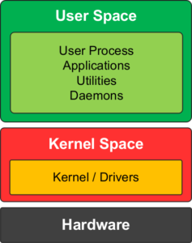
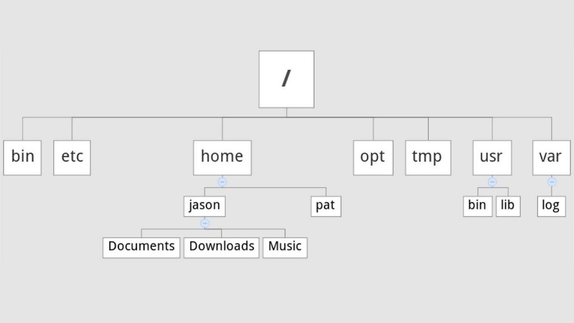
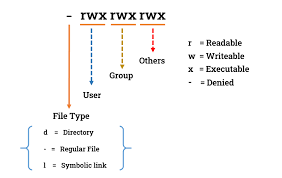

# Linux intro
## with Ubuntu

---

# O.S Kernel user space



---

# Linux Kernel and Distributions
A Linux distribution is an operating system composed of the 
- Linux kernel
-  package manager. 
-  applications
-  display server (GUI)


---


---

# Ubuntu


Ubuntu is a Linux distribution based on Debian and composed mostly of free and open-source software. Ubuntu is officially released in three editions: Desktop, Server, and Core for Internet of things devices and robots

---

# Ubuntu versions


- Release Every 6 month in (4, 10)
- LTS Release Every 2 years (20.04, 22.04)

---

# Terminal and BASH


- **Terminal** (emulator) is a GUI to interact with the shell.
- **shell** is a program that processes command and return output.
- **BASH**: shell scripting language

---
# Root tree



---
# pwd

## man pwd
```
pwd - print name of current/working directory
```

## pwd
```bash
pwd
/home/user

```

---

# ls

```
ls --help
Usage: ls [OPTION]... [FILE]...
List information about the FILEs 
```

## man ls
```
NAME
       ls - list directory contents

SYNOPSIS
       ls [OPTION]... [FILE]...

DESCRIPTION
       List  information  about the FILEs (the current directory by default).  Sort entries alphabeti‐
       cally if none of -cftuvSUX nor --sort is specified.

       Mandatory arguments to long options are mandatory for short options too.

       -a, --all
              do not ignore entries starting with .
```

---
# stdin / stdout / stderr
- 0: stdin
- 1: stdout
- 2: stderr


---

# Filesystem
Is the way in which files are named and where they are placed logically for storage and retrieval.

- FAT
- NTFS
- EXT4


### format

```
man mkfs.fat

mkfs.fat - create an MS-DOS FAT filesystem

```
```
mkfs.
mkfs.bfs     mkfs.cramfs  mkfs.ext3    mkfs.fat     mkfs.msdos   mkfs.vfat                          
mkfs.btrfs   mkfs.ext2    mkfs.ext4    mkfs.minix   mkfs.ntfs 
```

---

# Folders / Directories

- mkdir
- cd
- rmdir
- rm

---

# files and permission

- ls
- ll
- ls -lah
- cp
- rm

---

# files permission and owner

- chown
- chmod



