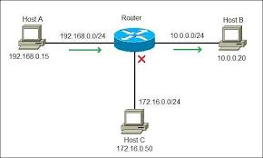
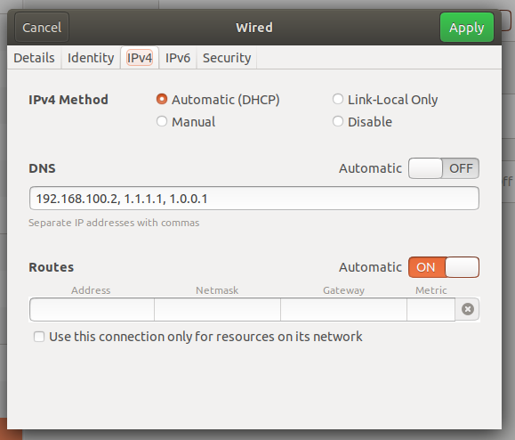

# Networking

---

# What is a computer network

A computer network comprises two or more computers that are connected—either by cables (wired) or WiFi (wireless)

---

# Network bazz ...

- LAN
- WAN
- Switch
- Router
- Modem
- ip address
- gateway
- DNS
- DHCP
- services
---

# LAN / WAN


---

# Modem / Router / Switch
- Convert to 
  


---

# Router

wikipedia: A router is a networking device that forwards data packets between computer networks.



- NAT
- Gateway

---

# Switch
wikipedia: A switch is a device in a computer network that connects other devices together.


---

# All in one


---

# Cable


---

# WIFI


---

# Network commands

- ping
- ifconfig

---

# Ping

- ICMP(8) - The Internet Control Message Protocol (ICMP) is a network layer protocol used by network devices to diagnose network communication issues.

**Ping**: command uses ICMP to send a packet to a remote host and wait for a response. This can be used to test the connectivity between two hosts and to measure the round-trip time (RTT) of a packet.

```
ping 8.8.8.8
```

---

# ifconfig

ifconfig is a system administration utility in Unix-like operating systems for network interface configuration.

```
lo: flags=73<UP,LOOPBACK,RUNNING>  mtu 65536
        inet 127.0.0.1  netmask 255.0.0.0
        inet6 ::1  prefixlen 128  scopeid 0x10<host>
        loop  txqueuelen 1000  (Local Loopback)
        
wlo1: flags=4163<UP,BROADCAST,RUNNING,MULTICAST>  mtu 1500
        inet 10.100.102.16  netmask 255.255.255.0  broadcast 10.100.102.255
        inet6 fe80::493f:baf7:5f6a:1d4c  prefixlen 64  scopeid 0x20<link>
        ether f4:4e:e3:a1:cc:c3  txqueuelen 1000  (Ethernet)
        

```

--- 

# Models


---

# DHCP


---

# DNS



---

# Service

Network service is an application called `server` that has service base on protocols

- Web
- Email
- zoom
- 
---

# Protocol
Network protocols are a set of rules outlining how connected devices communicate across a network to exchange information.


- HTTP
- DHCP
- DNS