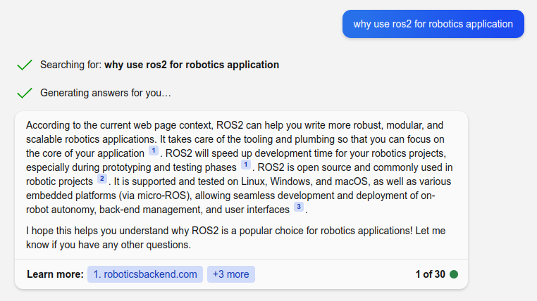
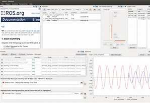

# ROS2 
What, Why and basic verbs and concept

---

# What
 - Open source software development kit for robotics applications.
 - Standard
 - From research and prototyping through to deployment and production

---

# Why

- For me it a STANDARD

---

# Verbs
- DDS
- Node
- Pub / Sub
- Service
- Action
- Parameters

---

# Tools
- Rqt
- Rviz
- Gazebo

---

# What to remember
- ROS2 is a standard
  - Don't invite the wheel
- It's all about Nodes and messages

---

# DDS
DDS (Data Distribution Service) is an open-standard connectivity framework for real-time systems

---

# Node message and topic

Node: A node is an executable that uses ROS to communicate with other nodes.
Message: ROS data type
Topics: ROS2 topic is a way of communication between ROS2 nodes

---

# Pub / Sub

---

# Service

---

# Action

---

# Demo

---

# Rqt
RQT is a Qt-based framework for GUI development for ROS

---

# Rviz
- Rviz is a 3D visualization tool for ROS
- It allows you to visualize sensor data and other information from your robot in real-time

---

# Gazebo / Ignition

---

# Without words

[video link](https://user-images.githubusercontent.com/24916364/162032176-a2d503a0-4f75-4785-b2e2-f24ba90b1819.mov)

---

# Final

- ROS is a standard 
- Way of thinking
- SDK for develop robotics application

