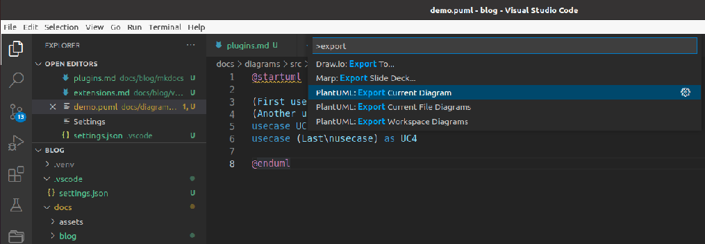

# DrawIO
{ align=left }
This unofficial extension integrates Draw.io into VS Code.

just create new file named `my_image.drawio.png` or `my_image.drawio.svg`

[VSCode marketplace](https://marketplace.visualstudio.com/items?itemName=hediet.vscode-drawio)
<br>
<br>
<br>

---

# PlantUML
{ align=left }

PlantUML is an open-source tool allowing users to create diagrams from a plain text language

[PlantUML in a nutshell](https://plantuml.com/)
<br>
<br>
<br>
<br>
```bash title="install"
java
graphviz
# 
sudo apt install graphviz
```

```json title="vscode settings"
"plantuml.diagramsRoot": "docs/diagrams/src",
"plantuml.exportOutDir": "docs/diagrams/out",
"plantuml.render": "Local"
```

### usage
- `Alt-D` Preview current diagram
- Create `diagrams/out` and `diagrams/src` folder under `docs` subfolder
- Use `Export current diagram` command to convert diagram to `png`
  


---

