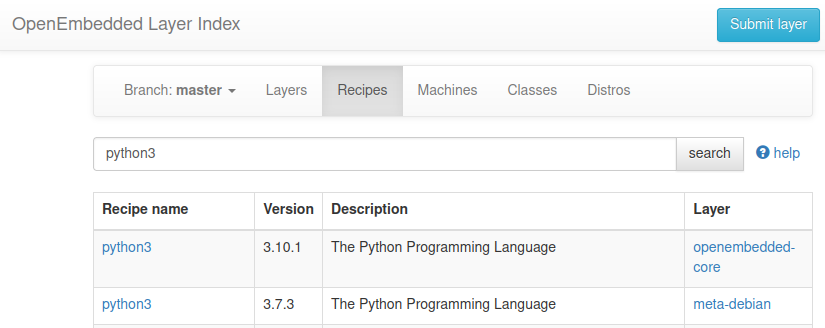
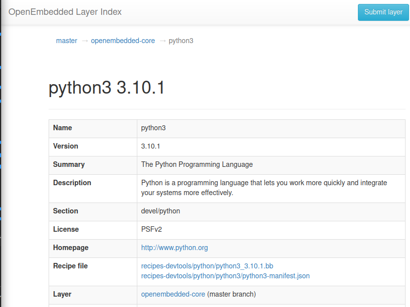

# Yocto project tree
- meta-external
  - meta-openembedded
  - poky

|   |   |
|---|---|
| meta-external  | share git project across multiple yocto project  |

!!! Help
    - git submodule
    - git submodule add <url>
    - git submodule update --init --recursive


# meta-external
Collection of yocto git repositories from git

```title="meta-openembedded"
git submodule add https://github.com/openembedded/meta-openembedded.git

```

# layers
Add layers to `bblayers.conf` file

```
bitbake-layers show-layers
NOTE: Starting bitbake server...
layer                 path                                      priority
==========================================================================
meta                  /home/user/yocto/poky/meta                5
meta-poky             /home/user/yocto/poky/meta-poky           5
meta-yocto-bsp        /home/user/yocto/poky/meta-yocto-bsp      5
meta-oe               /home/user/yocto/meta-external/meta-openembedded/meta-oe  6
meta-python           /home/user/yocto/meta-external/meta-openembedded/meta-python  7
```

---

# Add dropbear ssh
## OpenEmbedded
Search for dropbear recipe in openembedded [Layer index](https://layers.openembedded.org/layerindex/branch/master/recipes/)


!!! check
    openembedded-core is part of poky meta ? Yes 
    I found dropbear under `meta/recipes-core/dropbear`

## setup

- Add  to `local.conf`

```bash title="append to local.conf"
CORE_IMAGE_EXTRA_INSTALL += "dropbear"
```

!!! Note
    - **IMAGE_INSTALL** is the variable that controls what is included in any image.
    - **CORE_IMAGE_EXTRA_INSTALL** is a convenience variable that enable you to add extra packages to an image based on the core-image class

## Create image
```bash
# from build folder
bitbake core-image-minimal
```

## Check
```bash
# under build folder
ll tmp/work/qemux86_64-poky-linux/core-image-minimal/1.0-r0/rootfs/usr/sbin/dropbear
```

### run image with qemu
```title="run image"
runqemu tmp/deploy/images/qemux86-64/core-image-minimal-qemux86-64-<build number>.qemuboot.conf nographic

```

```bash title="check dropbear is running"
ps | grep drop
  259 root      3020 S    /usr/sbin/dropbear -r /etc/dropbear/dropbear_rsa_host_key -p 22 -B
  293 root      4224 S    grep drop

```

### ssh from host
```
ssh root@192.168.7.2
```

### check recipe location

```bash
bitbake -e dropbear | grep ^FILE=
# Result
FILE="/home/user/yocto/poky/meta/recipes-core/dropbear/dropbear_2020.81.bb"
```
---

# Add python3

- Search recipe


- Show recipe more info


## setup

- Add  to `local.conf`

```bash title="append to local.conf"
CORE_IMAGE_EXTRA_INSTALL += "dropbear python3"
```

### check recipe location
```bash
bitbake -e python3 | grep ^FILE=
FILE="/home/user/yocto/poky/meta/recipes-devtools/python/python3_3.9.9.bb"
```

## Create image
```bash
# from build folder
bitbake core-image-minimal
```


