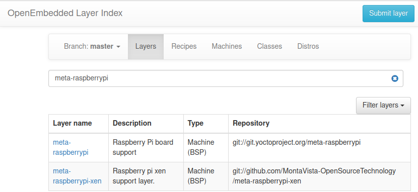
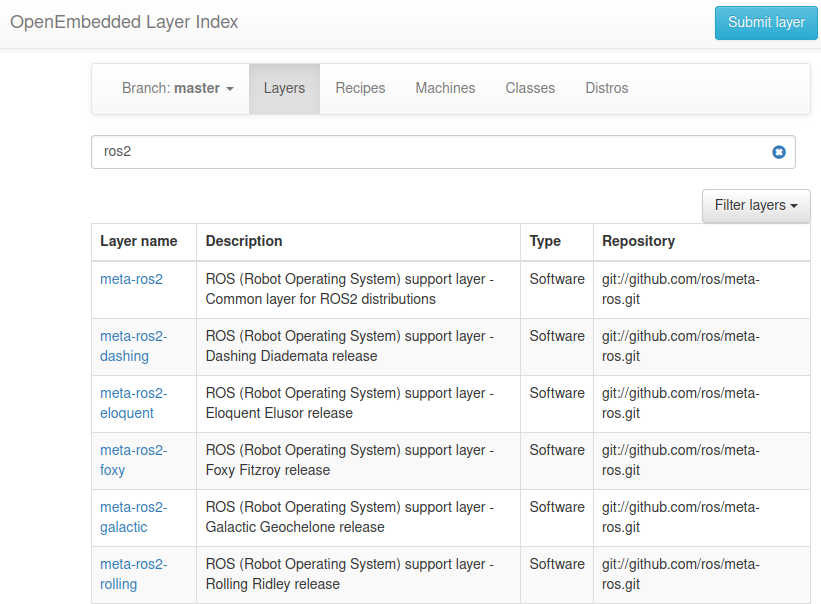

# Recipe
A recipe is a set of instructions that is read and processed by the bitbake (file with `.bb` extension)

A recipe describes:  
- Where to fetch source code  
- Which patch to apply  
- Configuration options  
- Compile options  
- Install  
- License  

---

# Configuration
Tell the build system what to build and put into the image (file with `.conf` extension)

## Types
- Machine configuration option
- Distribution option
- Compiler tuning options
- General Common configuration options
- User options (local.conf)

### Example machine config
User `local.conf` we set the machine for example `MACHINE ??= "qemux86-64"`

This setting tell the system to load machine configuration option `meta/conf/machine/qemux86-64.conf`

---

# Class
Class files are used to share common functionality across recipes (file with `.bbclsss` extension)

!!! Note
    classes useally locate in `classes` directory inside the `meta*` directory

## usage from recipe
```
inherit classname
```

---

# Layers
A collection of related recipes.  
layer isolate meta data according to functionality
recipes are folders under layer folder

!!! Note
    name convention for layer `meta-layername`

| name | description  |
|---|---|
| meta-poky  | Distro metadata  |
| meta-yocto-bsp  | BSP metadata  |


`BBLAYERS` variable present in `build/conf/bblayers.conf`

```title="show layers"
bitbake-layers show-layers
```

## Find a layer
[OpenEmbedded Layer Index](https://layers.openembedded.org/layerindex/branch/master/layers/)

<figure markdown>
  
  <figcaption>raspberrypi</figcaption>
</figure>

<figure markdown>
  
  <figcaption>ros2 layers</figcaption>
</figure>

---

# Image
An image is the top level recipe  
image define how the root filesystem is built , with what packages.

```bash title="list all images"
ls meta*/recipes*/images/*.bb
```

---

# Packages
A package is a binary file with name *.deb, *.rpm
Packages are produces by recipe
A signal recipe produces many packages. all recipe packages describe is `PACKAGES` variable