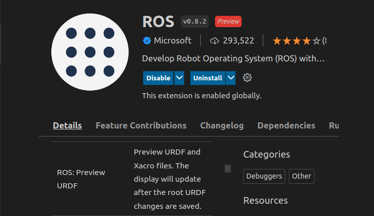
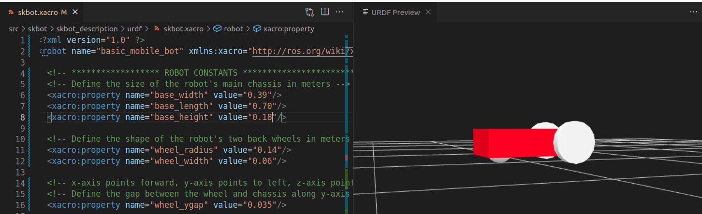
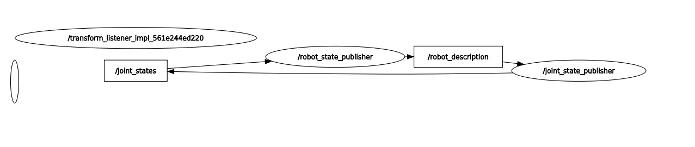
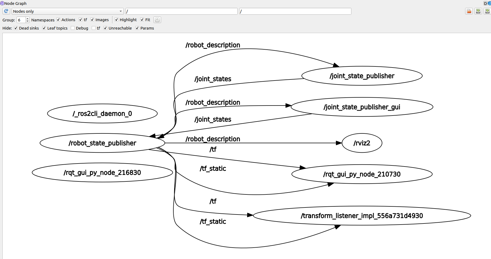
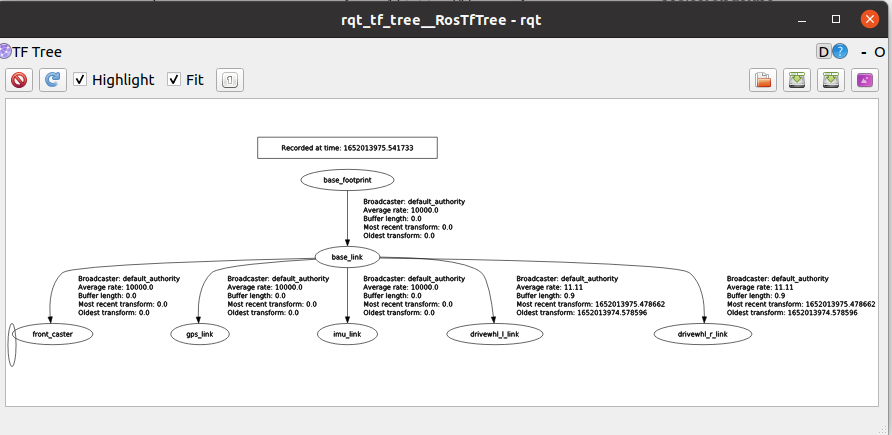

## Project structure
```
skbot_description/
├── CMakeLists.txt
├── config
├── launch
├── meshes
├── package.xml
├── sdf
├── src
└── urdf
```

## urdf / xacro
urdf / xacro main file `skbot.xacro`

| file  | description  |
|---|---|
| skbot.xacro  |   |
| materials.xacro  |   |
| macros.xacro  |   |
| gazebo.xacro  |   |

---

!!! Tip

    ### VSCode urdf preview

    { width=400px }

    { width=400px }

!!! Tip
    ### VSCode xml region
    ```
    <!-- #region -->
    ...
    <!-- #endregion -->
    ```


## joint_state_publisher
Publish `sensor_msgs/JointState` message via /joint_state topic,  
Its read `robot_description` published by `robot_state_publisher` find all of the non-fixed joints and publish jointState message with all those joints

## robot_state_publisher
The robot_state_publisher uses the URDF specified by the parameter `robot_description` and the joint position from the topic `/joint_state` to calculate the forward kinematics and publish the result via `/tf` topic

```bash title="topic list" linenums="1" hl_lines="5 7 9"
ros2 topic list
/clicked_point
/goal_pose
/initialpose
/joint_states
/parameter_events
/robot_description
/rosout
/tf
/tf_static
```

### robot_state_publisher joint_state_publisher relation


### launch
- parse XACRO
- run robot_state_publisher
- set robot_state_publisher `robot_description` parameter with URDF
- run joint_state_publisher


```python title="launch robot and joint state publisher" linenums="1" hl_lines="1"
#!/usr/bin/env python3
import os
from ament_index_python import get_package_share_directory
from launch import LaunchDescription
from launch_ros.actions import Node
import xacro

def generate_launch_description():

    pkg_skbot_description = get_package_share_directory("skbot_description")
    robot_description_path =  os.path.join(
        pkg_skbot_description,
        "urdf",
        "skbot.xacro",
    )

    doc = xacro.parse(open(robot_description_path))
    xacro.process_doc(doc)

    params = {'robot_description': doc.toxml()}

    node_robot_state_publisher = Node(
        package='robot_state_publisher',
        executable='robot_state_publisher',
        output='screen',
        parameters=[params]
    )

    node_joint_state_publisher = Node(
        package='joint_state_publisher',
        executable='joint_state_publisher',
        name='joint_state_publisher',
        output='screen',
        parameters=[params])

    ld = LaunchDescription()
    ld.add_action(node_robot_state_publisher)
    ld.add_action(node_joint_state_publisher)
    return ld
```

---
#### launch rviz and ...

- Run rviz with config
- Run joint state publisher gui to control joints


```python title="launch rviz and joint_state_publisher_gui"
import os
from ament_index_python import get_package_share_directory
from launch import LaunchDescription
from launch_ros.actions import Node
import os

def generate_launch_description():

    pkg_name = 'skbot_description'
    skbot_description_path = get_package_share_directory(pkg_name)

    joint_state_publisher_gui_node = Node(
        package='joint_state_publisher_gui',
        executable='joint_state_publisher_gui',
        name='joint_state_publisher_gui')

    rviz_node = Node(
            package='rviz2',
            namespace='',
            executable='rviz2',
            name='rviz2',
            arguments=['-d', [os.path.join(skbot_description_path, 'config', 'rviz.rviz')]]
        )

    ld = LaunchDescription()
    ld.add_action(joint_state_publisher_gui_node)
    ld.add_action(rviz_node)
    return ld
```

---

## rqt_graph include tf



!!! Note
    `rviz` is a "debug" node  
    View it by clear the debug checkbox for hide list  

    'tf' is also in the hide list

## joint_state_publisher_gui
The joint_state_publisher_gui send to joint_states topic  
It's use only for visualization

!!! Warning
    It's not a command to the robot  
    It's just a fake `encoder`  output
    Only for testing

---

## rqt_tf

```bash title="install"
ros-foxy-rqt-tf-tree
```

```bash title="run"
ros2 run rqt_tf_tree rqt_tf_tree
```



---

## Reference
- [#55: Robot State Publisher vs Joint State Publisher](https://youtu.be/9BdAkrX4Xkg)