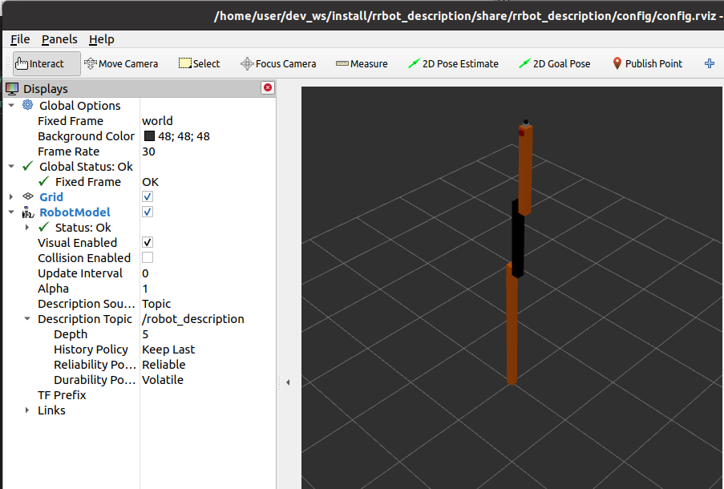

## project
```
rrbot_description
   ├── CMakeLists.txt
   ├── config
   │   └── config.rviz
   ├── launch
   │   ├── rviz1.launch.py
   │   └── rviz.launch.py
   ├── meshes
   │   └── hokuyo.dae
   ├── package.xml
   └── urdf
       ├── materials.xacro
       ├── rrbot.gazebo
       └── rrbot.xacro

```

---

### robot_state_publisher

robot_state_publisher uses the URDF specified by the parameter robot_description and the joint positions from the topic joint_states to calculate the forward kinematics of the robot and publish the results via tf.


```bash linenums="1" hl_lines="4 7"
ros2 node info /robot_state_publisher
# result
/robot_state_publisher
  Subscribers:
    /joint_states: sensor_msgs/msg/JointState
    /parameter_events: rcl_interfaces/msg/ParameterEvent
  Publishers:
    /parameter_events: rcl_interfaces/msg/ParameterEvent
    /robot_description: std_msgs/msg/String
    /rosout: rcl_interfaces/msg/Log
    /tf: tf2_msgs/msg/TFMessage
    /tf_static: tf2_msgs/msg/TFMessage

```

### joint_state_publisher

The package publishing sensor_msgs/msg/JointState messages for a robot described with URDF. Given a URDF (either passed on the command-line or via the /robot_description topic).

```bash linenums="1" hl_lines="4 6"
ros2 node info /joint_state_publisher 
# result
/joint_state_publisher
  Subscribers:
    /robot_description: std_msgs/msg/String
  Publishers:
    /joint_states: sensor_msgs/msg/JointState
```

---

## launch

```python title="rviz1.launch.py" linenums="1" hl_lines="1"
import os
from launch_ros.actions import Node
from launch import LaunchDescription
from ament_index_python.packages import get_package_share_directory

package_name = 'rrbot_description'

def generate_launch_description():
  rviz_config_path = os.path.join(
    get_package_share_directory(package_name),
    "config",
    "config.rviz")

  urdf_path = os.path.join(
    get_package_share_directory(package_name),
    "urdf",
    "rrbot.urdf")

  robot_state_publisher_node = Node(
    package='robot_state_publisher',
    executable='robot_state_publisher',
    arguments=[urdf_path]
  )

  joint_state_publisher_node = Node(
    package='joint_state_publisher',
    executable='joint_state_publisher',
    name='joint_state_publisher'
  )

  joint_state_publisher_gui_node = Node(
    package='joint_state_publisher_gui',
    executable='joint_state_publisher_gui',
    name='joint_state_publisher_gui'
  )

  rviz_node = Node(
    package='rviz2',
    executable='rviz2',
    name='rviz2',
    output='screen',
    arguments=['-d', rviz_config_path],
  )

  return LaunchDescription([
    joint_state_publisher_node,
    joint_state_publisher_gui_node,
    robot_state_publisher_node,
    rviz_node
  ])
```

!!! note "launch urdf"
    passing robot_description as parameter


    ```python
    with open(urdf_path, 'r') as infp:
        robot_desc = infp.read()

    robot_state_publisher_node = Node(
        package='robot_state_publisher',
        executable='robot_state_publisher',
        output='screen',
        parameters=[{ 'robot_description': robot_desc}]
    )
    ```
     

!!! note "launch xacro"

    ```python
    xacro_path = os.path.join(
        get_package_share_directory(package_name),
        "urdf",
        "robot.xacro")

    robot_desc = xacro.process_file(xacro_path).toxml()

    robot_state_publisher_node = Node(
        package='robot_state_publisher',
        executable='robot_state_publisher',
        output='screen',
        parameters=[{ 'robot_description': robot_desc}]
    )
    ```

---

## Run

```
ros2 launch rrbot_description rviz1.launch.py
```



!!! warning "RobotModel"
    Notice to `/robot_description` topic policy
    - Description Source: Topic
    - Description Topic: /robot_description
    - Reliability Policy: Reliable
    - Durability Policy: Volatile
     