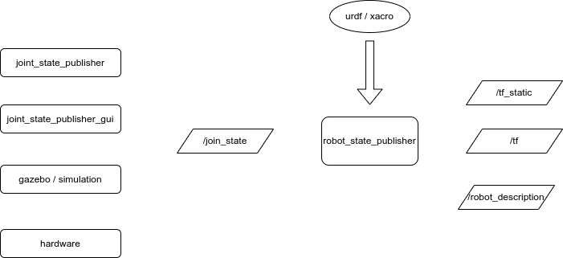
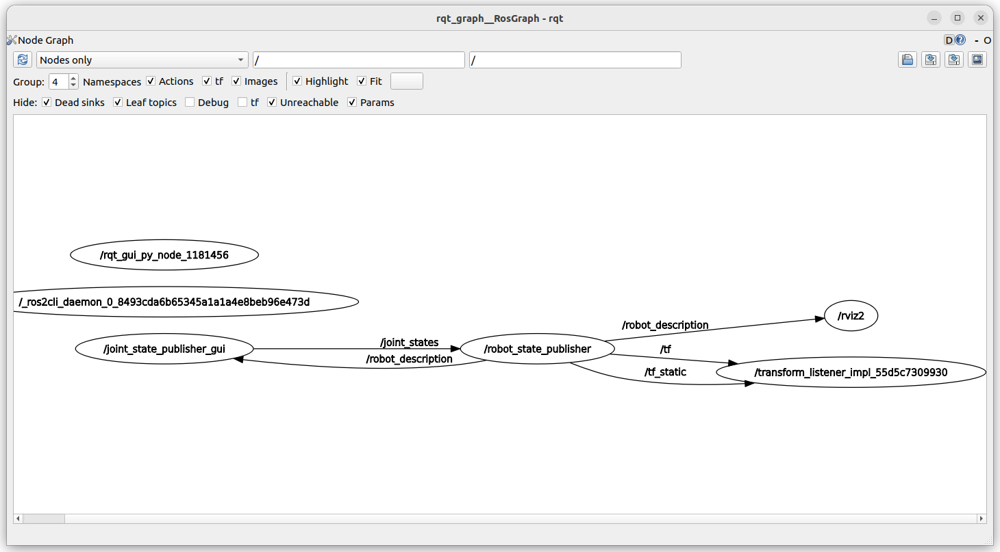
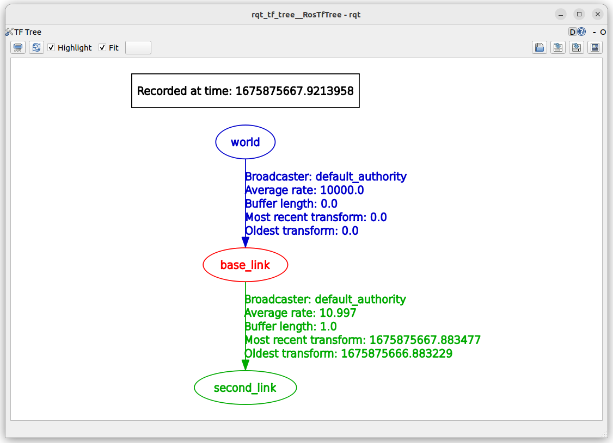
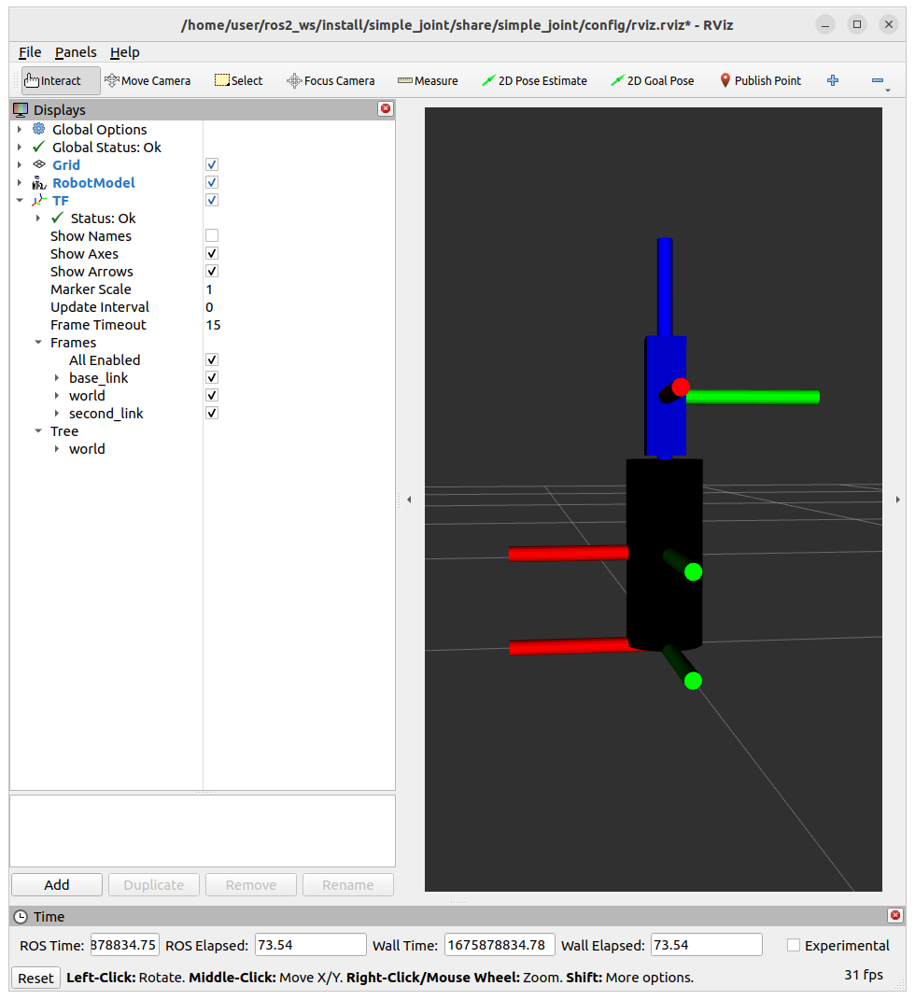

launch robot and control it's joint using
- joint_state_publisher
- joint_state_publisher using preset position (param and yaml file)
- joint_state_publisher_gui


## urdf
```xml title="robot.urdf"
<?xml version="1.0"?>
<robot name="simple_example">
    <link name="world"/>

    <material name="blue">
        <color rgba="0 0 0.8 1"/>
    </material>

    <material name="black">
        <color rgba="0 0 0 1"/>
    </material>

    <joint name="word2base" type="fixed">
        <parent link="world"/>
        <child link="base_link"/>
        <origin xyz="0.0 0.0 0.12" rpy="0.0 0.0 0.0"/>
    </joint>

    <link name="base_link">
        <inertial>
            <mass value="10" />
            <inertia ixx="0.4" ixy="0.0" ixz="0.0" iyy="0.4" iyz="0.0" izz="0.2"/>
        </inertial>
        <collision>
            <geometry>
                <cylinder radius="0.05" length="0.24" />
            </geometry>
        </collision>
        <visual>
            <geometry>
                <cylinder radius="0.05" length="0.24" />
            </geometry>
            <material name="black"/>
        </visual>
    </link>

    <link name="second_link">
        <inertial>
            <mass value="0.18" />
            <inertia ixx="0.0002835" ixy="0.0" ixz="0.0" iyy="0.0002835" iyz="0.0" izz="0.000324" />
        </inertial>
        <origin rpy="0.0 0.0 0.0" xyz="0.0 0.0 0.0" />
        <collision>
            <geometry>
                <box size="0.05 0.05 0.15" />
            </geometry>
        </collision>
        <visual>
            <geometry>
                <box size="0.05 0.05 0.15" />
            </geometry>
            <material name="blue"/>
        </visual>
    </link>

    <joint name="base_to_second_joint" type="continuous">
        <parent link="base_link"/>
        <child link="second_link"/>
        <axis xyz="0 0 1"/>
        <origin xyz="0.0 0.0 0.2" rpy="0.0 0.0 0.0"/>
    </joint>

</robot>
```

## launch
- load robot urdf 
- run `robot_state_publisher`
- run `joint_state_publisher`
- run rviz to check `robot_description` and joints

```python title="sim_visual_v1.launch.py"
from launch import LaunchDescription
from launch_ros.actions import Node
from ament_index_python.packages import get_package_share_directory
import os
import xacro

PACKAGE = "simple_joint"
URDF = "robot.urdf"


def generate_launch_description():
    ld = LaunchDescription()
    pkg = get_package_share_directory(PACKAGE)

    robot_description_path = os.path.join(pkg, "urdf", URDF)
    doc = xacro.parse(open(robot_description_path))
    xacro.process_doc(doc)

    robot_state_publisher = Node(
        package="robot_state_publisher",
        executable="robot_state_publisher",
        parameters=[{"robot_description": doc.toxml()}],
    )

    joint_state_publisher_node = Node(
        package="joint_state_publisher",
        executable="joint_state_publisher",
        name="joint_state_publisher"
    )

    rviz_node = Node(
        package="rviz2",
        namespace="",
        executable="rviz2",
        name="rviz2",
        arguments=["-d" + os.path.join(pkg, "config", "rviz.rviz")],
    )

    ld.add_action(joint_state_publisher_node)
    ld.add_action(robot_state_publisher)
    ld.add_action(rviz_node)
    return ld

```



## topics and nodes



```bash
ros2 topic list
#
...
/joint_states
/robot_description
/rosout
/tf
/tf_static

```
## rviz


## tf tree




## joint preset
- using `joint_state_publisher` to set joint position
 


```python
joint_state_publisher_node = Node(
        package="joint_state_publisher",
        executable="joint_state_publisher",
        name="joint_state_publisher",
        parameters=[{'zeros.base_to_second_joint': 1.5}]
    )
```

or using `yaml`

```python
config = os.path.join(
    pkg,
    'config',
    'init_position.yaml'
    )

joint_state_publisher_node = Node(
    package="joint_state_publisher",
    executable="joint_state_publisher",
    name="joint_state_publisher",
    parameters=[config]
)
```

```yaml title="config/init_position.yaml"
joint_state_publisher:
  ros__parameters:
    zeros:
      base_to_second_joint: 1.57
```

## joint_state_gui

```python title="joint_state_publisher_gui"
joint_state_publisher_node = Node(
    package="joint_state_publisher_gui",
    executable="joint_state_publisher_gui",
    name="joint_state_publisher_gui",
    parameters=[config]
)

```


# Reference
- [Getting Ready for ROS Part 6: The Transform System](https://articulatedrobotics.xyz/ready-for-ros-6-tf/)