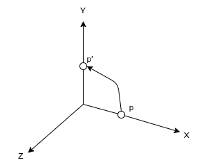
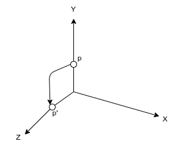
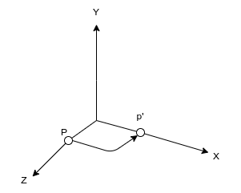

---
tags:
    - matrix
    - rotation
    - 3d
---

# 3D Rotation

## Rz

$$
\begin{bmatrix}
x & y & z & 1
\end{bmatrix}
\begin{bmatrix}
cos\theta & sin\theta & 0 & 0 \\
-sin\theta & cos\theta & 0 & 0 \\
0 & 0 & 1 & 0 \\
0 & 0 & 0 & 1
\end{bmatrix}
$$

#### Demo

$$
p = (1,0,0) \\
\theta=90 \\
{p}' = (0,1,0)
$$

$$
\begin{bmatrix}
1 & 0 & 0 & 1
\end{bmatrix}
\begin{bmatrix}
0 & 1 & 0 & 0 \\
-1 & 0 & 0 & 0 \\
0 & 0 & 1 & 0 \\
0 & 0 & 0 & 1
\end{bmatrix}=
\begin{bmatrix}
0 & 1 & 0 & 1
\end{bmatrix}
$$

---

## Rx

$$
\begin{bmatrix}
x & y & z & 1
\end{bmatrix}
\begin{bmatrix}
1 & 0 & 0 & 0 \\
0 & cos\theta & sin\theta & 0 \\
0 & -sin\theta & cos\theta & 0 \\
0 & 0 & 0 & 1
\end{bmatrix}
$$

#### Demo

$$
p = (0, 1, 0) \\
\theta = 90 \\
{p}' = (1, 0, 0)
$$

$$
\begin{bmatrix}
0 & 1 & 0 & 1
\end{bmatrix}
\begin{bmatrix}
1 & 0 & 0 & 0 \\
0 & 0 & 1 & 0 \\
0 & -1 & 0 & 0 \\
0 & 0 & 0 & 1
\end{bmatrix}=
\begin{bmatrix}
0 & 0 & 1 & 1
\end{bmatrix}
$$

---

## Ry

$$
\begin{bmatrix}
x & y & z & 1
\end{bmatrix}
\begin{bmatrix}
cos\theta & 0 & -sin\theta & 0 \\
0 & 1 & 0 & 0 \\
sin\theta & 0 & cos\theta & 0 \\
0 & 0 & 0 & 1
\end{bmatrix}
$$

### Demo

$$
p = (0, 0, 1) \\
\theta = 90
{p}' = (1, 0, 0)
$$

$$
\begin{bmatrix}
0 & 0 & 1 & 1
\end{bmatrix}
\begin{bmatrix}
0 & 0 & -1 & 0 \\
0 & 1 & 0 & 0 \\
1 & 0 & 0 & 0 \\
0 & 0 & 0 & 1
\end{bmatrix}=
\begin{bmatrix}
1 & 0 & 0 & 1
\end{bmatrix}
$$

