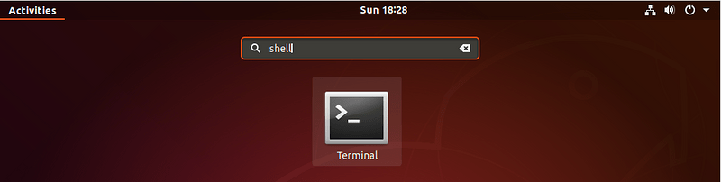
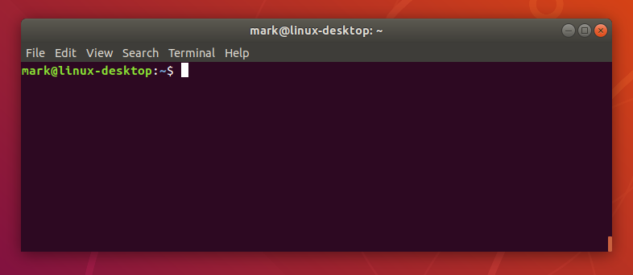
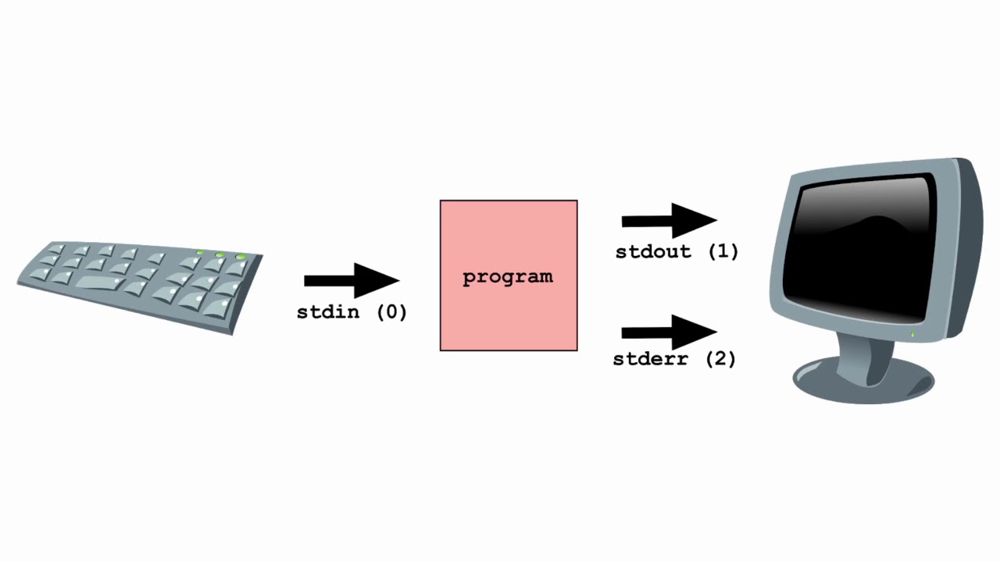
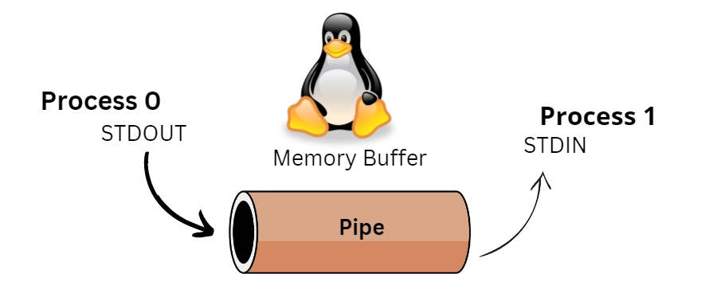

---
tags:
    - family
    - linux
---



```
Ctrl-Alt-T
```




### Standard IO


[How to use Linux Standard Input and Output](https://youtu.be/YYz8Y_UBrvw)


### Pipe and redirection


[Pipes and Redirection](https://youtu.be/oyc_6UfoW3w)


### Basic command
[Basic Commands in Linux | ECHO , CD , PWD , CAT , LS Commands ](https://youtu.be/GU5J_HUszM4)


### File system commands

[Linux Directory Commands |mkdir, rmdir, pwd, ls, cd](https://youtu.be/U34fDRaxgx0)

---

## Summary

- Open terminal
- pwd
- stdin stdout stderr
- cat
- redirect
- pipe
- echo
- cd
- rmdir
- mkdir
- ls