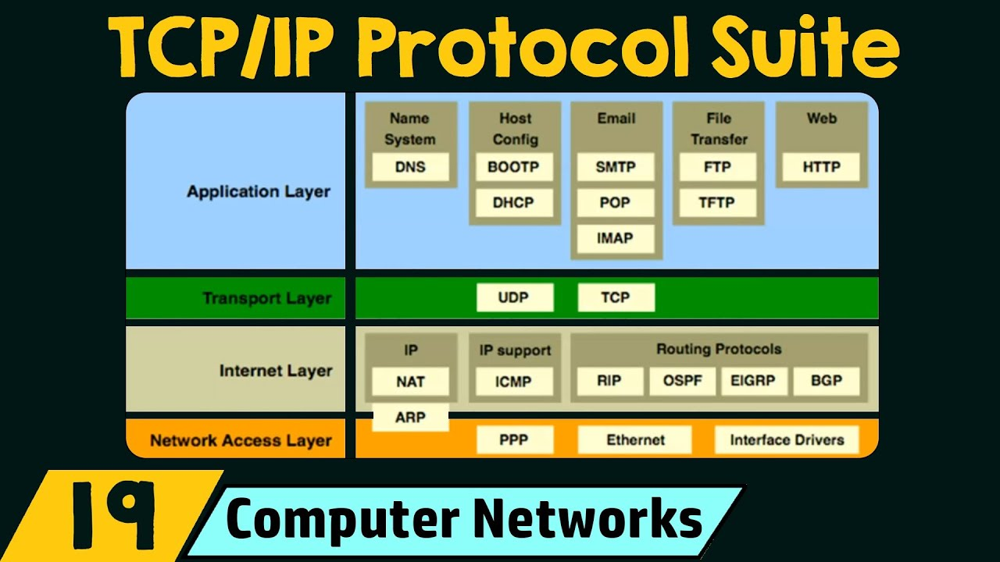
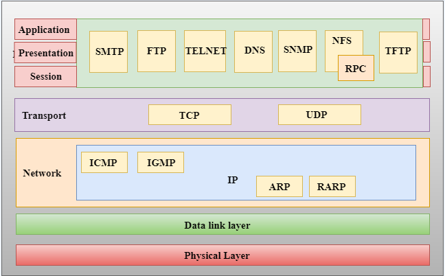

---
tags:
    - family
    - networking
---

### TCP/IP networking
[TCP IP Model Explained](https://youtu.be/2QGgEk20RXM?list=PLBbU9-SUUCwUyqvfypPAHWOaDr7Wz4P6t)




### IPv4 Address

[Public vs Private IP Address ](https://youtu.be/po8ZFG0Xc4Q)

### Ping
[What is ping?](https://youtu.be/tVOHTjf94M8)



## Summary

- IPv4 address
  - subnet
- TCP
- IP
- Port
- Ping
- LAN
- Router
- NAT
- WAN
- DHCP
- DNS
- [MAC address](https://en.wikipedia.org/wiki/MAC_address)
- 

## Linux network commands

### ifconfig

```
```

### ip

```
ip address show
```