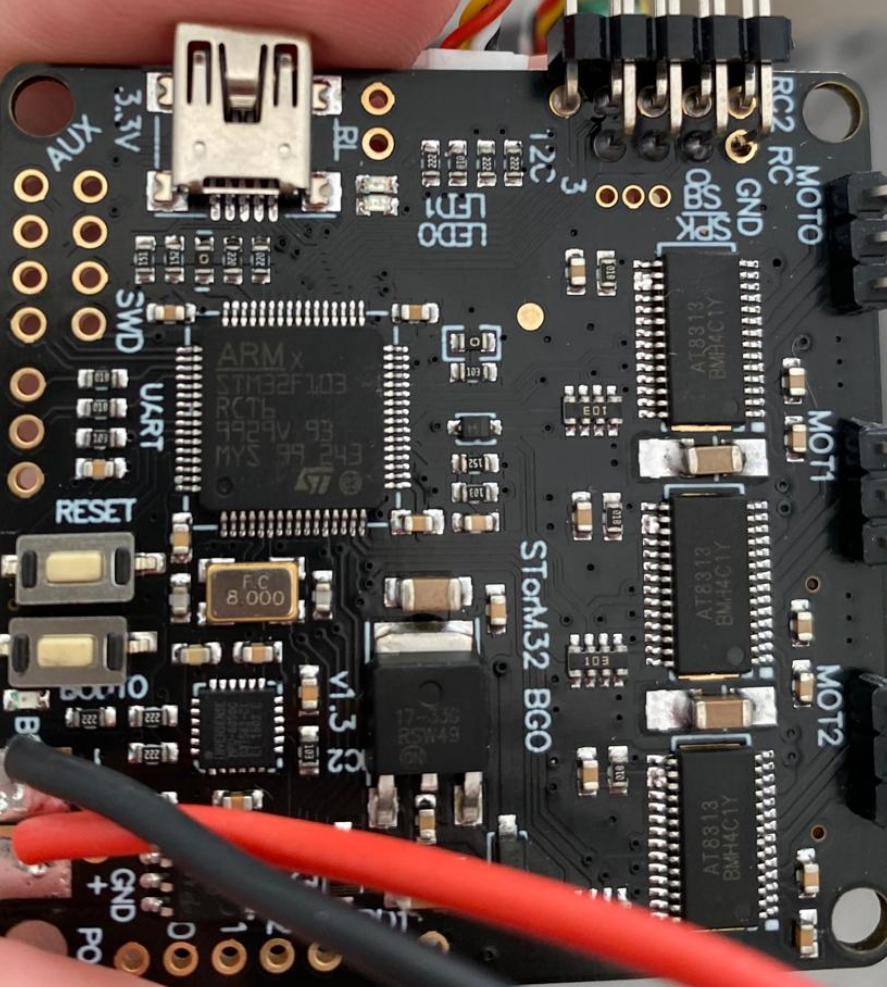

---
tags:
    - gimbal
    - storm32
    - bldc
    - stm32
    - mbed
---

# Gimbal

Control 3D gimbal using stm32 and BLDC motors base on Storm32bgc ver 1.32
The bord use STM32F103RCT6 microcontroller [datasheet](file:///home/user/Downloads/stm32f103ze.pdf)

## Board

## Wiring

## Reference
- [Nucleo SWD + MBED to reprogram StorM32 Controller](https://hackaday.io/project/168990-nucleo-swd-mbed-to-reprogram-storm32-controller)   