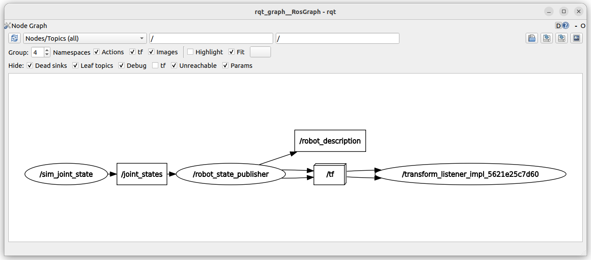
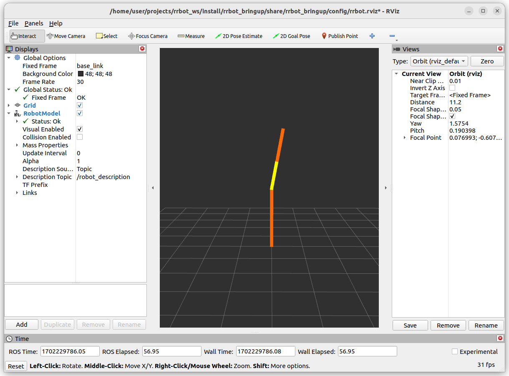

---
tags:
    - joint_states
    - JointState
    - Header
---

Using rrbot robot to sim `JointState` msg over `joint_states` topic 
- Write custom node to generate JointState message over joint_states topic
- Show result with RVIZ


---

## Sim JointState

!!! tip "Msg Header"
    ```python
    msg.header = Header()
    msg.header.frame_id = ""
    msg.header.stamp = self.get_clock().now().to_msg()
    ```
     
```python title="sim_joint_state.py"
import math
import time
import rclpy
from rclpy.node import Node
from rclpy.qos import qos_profile_sensor_data
from sensor_msgs.msg import JointState
from std_msgs.msg import Header


AMPLITUDE = 30
FREQ = 1 / 5
TOPIC = "/joint_states"

class MyNode(Node):
    def __init__(self):
        node_name = "sim_joint_state"
        super().__init__(node_name)
        self.create_timer(FREQ, self.timer_handler)
        self.joint_pub = self.create_publisher(
            JointState, TOPIC, qos_profile=qos_profile_sensor_data
        )

    def timer_handler(self):
        deg = AMPLITUDE * math.sin(time.time() * FREQ)
        rad = math.radians(deg)
        msg = JointState()
        msg.header = Header()
        msg.header.frame_id = ""
        msg.header.stamp = self.get_clock().now().to_msg()
        msg.name = ["joint1", "joint2"]
        msg.position = [rad, 0.0]
        msg.velocity = []
        msg.effort = []
        self.joint_pub.publish(msg)


def main(args=None):
    rclpy.init(args=args)
    node = MyNode()
    rclpy.spin(node)
    node.destroy_node()
    rclpy.shutdown()


if __name__ == "__main__":
    main()

```


### launch
- Run xacro parse to URDF
- Run JointStatePublisher
- Run RVIZ
- Run custom node to sim that sim `JointState` msg


```python
from launch.substitutions import PathJoinSubstitution, Command, FindExecutable
from launch_ros.substitutions import FindPackageShare
from launch_ros.actions import Node
from launch import LaunchDescription
import xacro

PKG = "rrbot_bringup"
URDF_FILE = "rrbot.urdf.xacro"
PKG_DESCRIPTION = "rrbot_description"


def generate_launch_description():
    ld = LaunchDescription()

    rviz_config_file = PathJoinSubstitution(
        [FindPackageShare(PKG), "config", "rrbot.rviz"]
    )

    robot_description_content = Command(
        [
            PathJoinSubstitution([FindExecutable(name="xacro")]),
            " ",
            PathJoinSubstitution(
                [
                    FindPackageShare(PKG_DESCRIPTION),
                    "urdf",
                    URDF_FILE,
                ]
            ),
        ]
    )

    params = {"robot_description": robot_description_content, "use_sim_time": True}
    node_robot_state_publisher = Node(
        package="robot_state_publisher",
        executable="robot_state_publisher",
        output="screen",
        parameters=[params],
    )

    rviz_node = Node(
        package="rviz2",
        executable="rviz2",
        name="rviz2",
        output="log",
        arguments=["-d", rviz_config_file],
    )

    app_node = Node(
        package="rrbot_application",
        executable="sim_joint_state",
        name="sim_joint_state",
        output="log"
    )

    ld.add_action(node_robot_state_publisher)
    ld.add_action(app_node)
    ld.add_action(rviz_node)
    return ld

```

---



