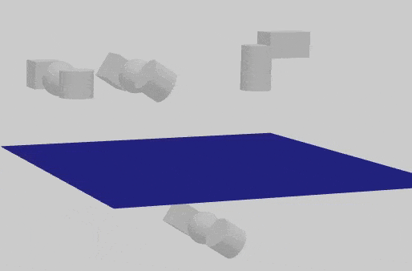

vrx  buoyancy plugin demo  
plugin code and world from vrx project [usv_gazebo_plugins](https://github.com/osrf/vrx/tree/master/usv_gazebo_plugins)  
buoyancy_gazebo_plugin depend on `wave_gazebo_plugins` project also from vrx project


### Plugin
- linear drag


$$
F_d = \beta_l m \frac{V}{V_T} (\boldsymbol{v_w} - \boldsymbol{v_c})
$$

- angular drag (torque)

$$
T_d = \beta_a m \frac{V}{V_T} L^2 \omega
$$




```xml
<model name="2_box">
    <pose>0.1 0.5 0.5 1.0 0 0</pose>
    <static>False</static>
    <link name="link">
    <visual name="visual">
        <geometry>
        <box>
            <size>0.171 0.171 0.171</size>
        </box>
        </geometry>
    </visual>
    <collision name="collision">
        <geometry>
        <box>
            <size>0.171 0.171 0.171</size>
        </box>
        </geometry>
    </collision>
    <inertial>
        <mass>2</mass>
        <inertia>
        <ixx>0.009708012000000002</ixx>
        <ixy>0</ixy>
        <ixz>0</ixz>
        <iyy>0.009708012000000002</iyy>
        <iyz>0</iyz>
        <izz>0.009708012000000002</izz>
        </inertia>
    </inertial>
    </link>
    <plugin filename="libbuoyancy_gazebo_plugin.so" name="BuoyancyPlugin">
    <fluid_density>1000</fluid_density>
    <fluid_level>0.0</fluid_level>
    <linear_drag>10.0</linear_drag>
    <angular_drag>4.0</angular_drag>
    <buoyancy name="buoyancy">
        <link_name>link</link_name>
        <geometry>
        <box>
            <size>0.171 0.171 0.171</size>
        </box>
        </geometry>
    </buoyancy>
    </plugin>
</model>
```

!!! note
    The above code is part of `buoyancy_plugin_demo.world`
---

# References
-[vrx github](https://github.com/osrf/vrx)
-[vrx buoyancy_plugin](https://github.com/osrf/vrx/wiki/documentation-buoyancy_plugin)

