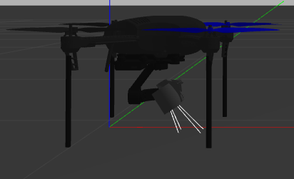
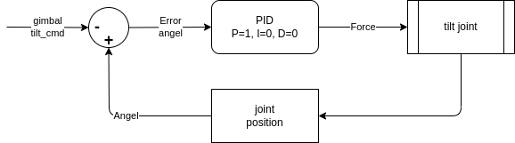

Using models from [osrf github](https://github.com/osrf/gazebo_models)
- iris_with_standoffs
- gimbal_small_2d


## gz cli
using gz cli to get info and control 

### gimbal topic

```bash
gz topic -l | grep iris
# result
/gazebo/default/iris_demo/gimbal_small_2d/base_link/wrench
/gazebo/default/iris_demo/gimbal_small_2d/tilt_link/camera/cmd
/gazebo/default/iris_demo/gimbal_small_2d/tilt_link/camera/image
/gazebo/default/iris_demo/gimbal_small_2d/tilt_link/wrench
/gazebo/default/iris_demo/gimbal_tilt_cmd
/gazebo/default/iris_demo/gimbal_tilt_status

```

---

### Gimbal tilt
#### Control
Control tilt using `gimbal_tilt_cmd` topic

```bash title="gimbal_tilt_cmd" linenums="1" hl_lines="3 7"
gz topic --info /gazebo/default/iris_demo/gimbal_tilt_cmd
# Result
Type: gazebo.msgs.GzString

Publishers:

Subscribers:
	192.168.1.207:46047
```

{ align=left height=100}

{ height=100}


```bash title="pub"
gz topic -p /gazebo/default/iris_demo/gimbal_tilt_cmd --msg "data: '1'"
gz topic -p /gazebo/default/iris_demo/gimbal_tilt_cmd --msg "data: '0'"
```

---

#### Info / Status

```bash title="gimbal_tilt_status" linenums="1" hl_lines="3 7"
gz topic --info /gazebo/default/iris_demo/gimbal_tilt_status
# Result
Type: gazebo.msgs.GzString

Publishers:
	192.168.1.207:46047

Subscribers:

```

```bash title="cli"
gz topic --echo /gazebo/default/iris_demo/gimbal_tilt_status
# result
data: "-0.00196318"

data: "-0.00196315"

data: "-0.00196316"

```


---

# Control from code
Using `pygazebo` project [github](https://github.com/robobe/pygazebo)
To send Protobuf messages using python

```python
--8<-- "docs/projects/wasp/gimbal/gazebo/source/tilt_control.py"
```

---

# Plugin

To Control and get gimbal status gazebo uses plugin `GimbalSmall2dPlugin` [source code](https://github.com/osrf/gazebo/blob/gazebo11/plugins/GimbalSmall2dPlugin.cc)

The plugin expose `gimbal_tilt_cmd` as tilt command in angel (radian) and translate it's to force command with PID controller  



